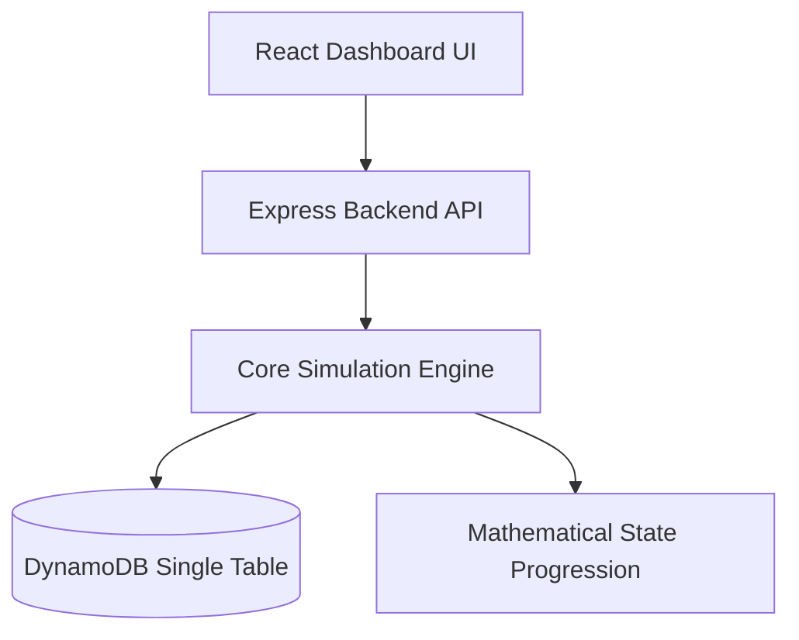

# 01. Project Overview

## 1. Purpose
The **Financial Literacy Simulator (FLS)** is an open-source, gamified life-simulation engine. Its primary purpose is to transition financial education from passive theory to experiential learning, allowing young adults in India to safely experience 50 years of financial decisions in a compressed, simulated timeframe (1 Game Week = 1 Simulated Month).

## 2. Scope
This document outlines the high-level scope of the MVP (Minimum Viable Product) required for the successful completion of the engineering internship. 

**In-Scope (Internship MVP):**
* Core stateful time-engine (Simulated Months).
* Basic financial tracking (Cash, Debt, Assets, Net Worth).
* Domain modeling for basic Indian financial realities (Taxes, SIPs, EMIs).
* A web-based dashboard for users to make decisions and view historical charts.
* A static random event engine (hazards and life shocks).

**Out-of-Scope (Deferred to Post-Internship/Future):**
* Generative AI (LLMs, dynamic storytelling).
* Multiplayer (Co-op households, peer-to-peer insurance).
* Real-time macroeconomic simulations (shared dynamic economy).

## 3. Definitions
* **MVP:** Minimum Viable Product. The smallest functional version of the simulator that satisfies internship requirements.
* **SDT (Self-Determination Theory):** A psychological theory underpinning the game design, focusing on intrinsic mastery rather than extrinsic rewards like badges.
* **Archetype:** A starting configuration for a player (e.g., *Farmer*, *New Entrant at Workplace*) determining initial salary, expenses, and risk profile.

## 4. High-Level Architecture Context

## 5. References
* [02_VISION.md](02_VISION.md) - For the long-term product vision.
* [03_REQUIREMENTS.md](03_REQUIREMENTS.md) - For detailed technical and business requirements.
* `docs/research/Books/` - Source of all domain knowledge and mathematical rules.

## 6. Future Considerations
While the MVP focuses purely on deterministic math and single-player survival, the architecture MUST remain modular enough to eventually plug in the `AI Storyteller` and `Macroeconomic Event Engine` without requiring a full database rewrite.
