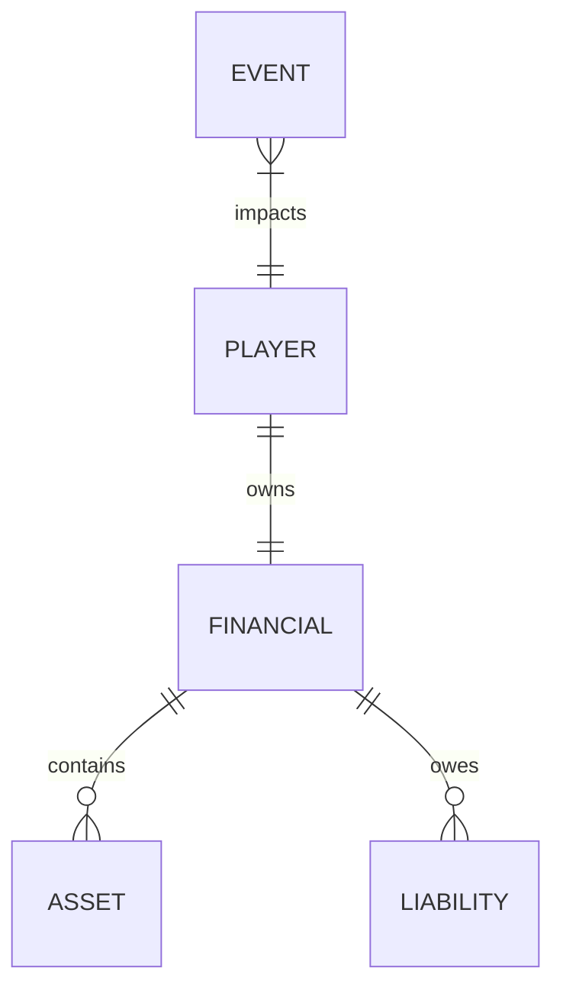

# 05. Domain Model

## 1. Purpose
This document defines the core business domains for the Financial Literacy Simulator. It establishes a ubiquitous language for developers to use when naming classes, modules, and database entities.

## 2. Scope
Covers the entity groupings within the MVP boundary, ensuring that code architecture directly mirrors real-world financial realities.

## 3. Definitions
* **Domain:** A sphere of knowledge, influence, or activity around which the software is designed (DDD - Domain Driven Design).
* **Aggregate Root:** The primary entity within a domain through which all interactions occur (e.g., `User` in the Player Domain).

## 4. The Domains

### 4.1 Player Domain
* **Purpose:** Manages identity and life progression.
* **Responsibilities:** Archetype selection, age tracking, and well-being.
* **Inputs:** Registration data, monthly tick event.
* **Outputs:** Updated age, updated life-stage.
* **Dependencies:** None.

### 4.2 Financial Domain (The General Ledger)
* **Purpose:** Acts as the single source of truth for total liquidity.
* **Responsibilities:** Calculating net worth, preventing negative balances without debt triggers.
* **Inputs:** Income, Expenses.
* **Outputs:** Current Cash, Total Net Worth.
* **Dependencies:** Asset Domain, Liability Domain.

### 4.3 Asset Domain
* **Purpose:** Manages appreciating financial instruments.
* **Responsibilities:** Applying compound growth to mutual funds (SIPs), tracking fixed deposits.
* **Inputs:** User investments, market fluctuation ticks.
* **Outputs:** Current asset valuation.
* **Dependencies:** Event Domain (for market crashes).

### 4.4 Liability Domain
* **Purpose:** Manages depreciating or interest-bearing debt.
* **Responsibilities:** Deducting EMIs, calculating compound interest on unpaid balances.
* **Inputs:** New loans, EMI payments.
* **Outputs:** Current debt burden.
* **Dependencies:** None.

### 4.5 Event Domain
* **Purpose:** Introduces environmental hazards and shocks.
* **Responsibilities:** Randomly selecting an event from the NCFE fraud/scam dictionary and applying penalties.
* **Inputs:** Monthly tick event.
* **Outputs:** Event payloads (e.g., `amountDeducted: 5000, reason: "Phishing Scam"`).
* **Dependencies:** Player Domain (events may vary by archetype).

## 5. Domain Relationship Map

## 6. References
* [06_BUSINESS_RULES.md](06_BUSINESS_RULES.md)
* [10_DATABASE_DESIGN.md](10_DATABASE_DESIGN.md)

## 7. Future Considerations
The `Economy Domain` (macro-level inflation and interest rates shared across all players) will be introduced post-internship.
