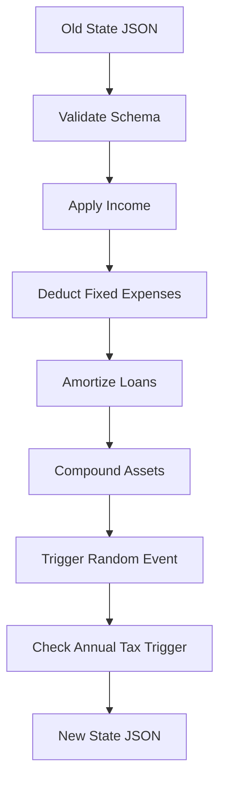

# 07. Simulation Engine

## 1. Purpose
This document defines the core architecture and boundaries of the `SimulationEngine`. This is the most critical component of the entire project.

## 2. Scope
The `SimulationEngine` is a pure mathematical module. It handles the processing of state transitions from Month `N` to Month `N+1`.

## 3. Definitions
* **Pure Function:** A function where the return value is only determined by its input values, without observable side effects (e.g., no database calls, no network requests).
* **State Transition:** The act of taking a `SimulationState` object and returning a new `SimulationState` object.

## 4. Architecture Constraints (Clean Architecture)

To ensure 100% testability, the `SimulationEngine` MUST NOT possess any dependencies on:
* Express.js (HTTP context)
* DynamoDB (Database context)
* External APIs (Network context)

The Engine is a simple data-in, data-out pipeline.

## 5. The Engine Pipeline



## 6. Input/Output Signature

```typescript
// Example TypeScript signature
interface SimulationRequest {
    currentState: PlayerState;
    playerDecisions: MonthlyDecisions; // e.g., how much to invest this month
}

type AdvanceMonth = (req: SimulationRequest) => PlayerState;
```

## 7. References
* [08_GAME_LOOP.md](08_GAME_LOOP.md)
* [18_TESTING_STRATEGY.md](18_TESTING_STRATEGY.md)

## 8. Future Considerations
In post-MVP phases, the engine will need to accept a third parameter `MacroEconomyState` to factor in real-time inflation or market crashes driven by an AI Storyteller.
