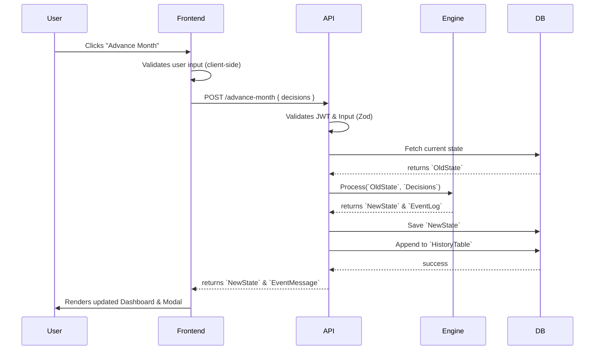

# 08. Game Loop

## 1. Purpose
This document defines the lifecycle of a single "Turn" (a month) from the perspective of the entire system, mapping how the UI, API, and Engine interact.

## 2. Scope
Covers the request/response cycle for the `/api/simulation/advance-month` endpoint.

## 3. The Lifecycle Diagram

## 4. Lifecycle Phases

### 4.1 Input Phase (Client Side)
The user allocates their available `Cash`. They can choose to:
* Make extra payments toward `Debt`.
* Move cash into `FixedDeposits` or `Equities`.
* Keep cash as liquid savings.

### 4.2 Validation Phase (API Side)
The server validates that:
* `Total Allocated <= Cash`.
* Inputs are positive integers.
* User is not already `Bankrupt` or `Retired`.

### 4.3 Engine Phase
The `SimulationEngine` runs the pipeline (as defined in `07_SIMULATION_ENGINE.md`).

### 4.4 Persistence Phase
The Database saves the current state. Crucially, it must also append a historical snapshot to allow the frontend to draw the Net Worth progression chart.

## 5. References
* [07_SIMULATION_ENGINE.md](07_SIMULATION_ENGINE.md)
* [11_API_SPECIFICATION.md](11_API_SPECIFICATION.md)

## 6. Future Considerations
When Multiplayer is introduced, the Game Loop will require distributed locking (Redis/DynamoDB Transactions) to ensure both players in a household submit their decisions before the month advances.
