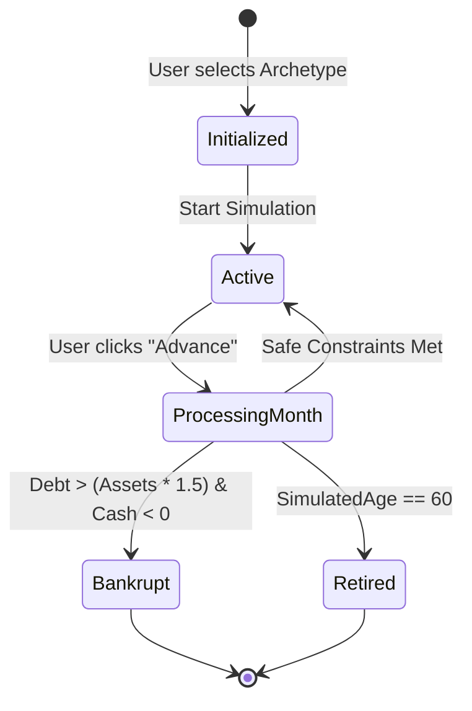

# 15. Player State

## 1. Purpose
This document defines the exact data structure of a player during any given month of the simulation. It represents the JSON object passed between the backend engine and the frontend UI.

## 2. Scope
Defines the state properties for the MVP. It does not dictate database schema mapping (which is covered in `10_DATABASE_DESIGN.md`).

## 3. Definitions
* **Archetype:** Defines the starting state (e.g., initial cash, salary, and debt).
* **State Snapshot:** The complete record of the player at Month X.

## 4. State Structure

```json
{
  "userId": "usr_123abc",
  "simulationData": {
    "currentMonth": 1,
    "simulatedAgeYears": 22,
    "archetype": "NEW_ENTRANT",
    "isBankrupt": false,
    "isRetired": false
  },
  "financials": {
    "cash": 50000,
    "netWorth": 35000,
    "monthlyIncome": 30000,
    "fixedExpenses": 15000,
    "accumulatedTaxableIncome": 30000
  },
  "assets": {
    "fixedDeposits": 0,
    "equities": 5000
  },
  "liabilities": {
    "studentLoan": 20000,
    "creditCard": 0
  },
  "metrics": {
    "wellbeingScore": 85
  }
}
```

## 5. State Transition Flow



## 6. References
* [06_BUSINESS_RULES.md](06_BUSINESS_RULES.md)
* [16_FINANCIAL_MODEL.md](16_FINANCIAL_MODEL.md)

## 7. Future Considerations
Future expansions will add arrays for `activeInsurancePolicies`, `ownedProperties`, and `coOpPartners`.
