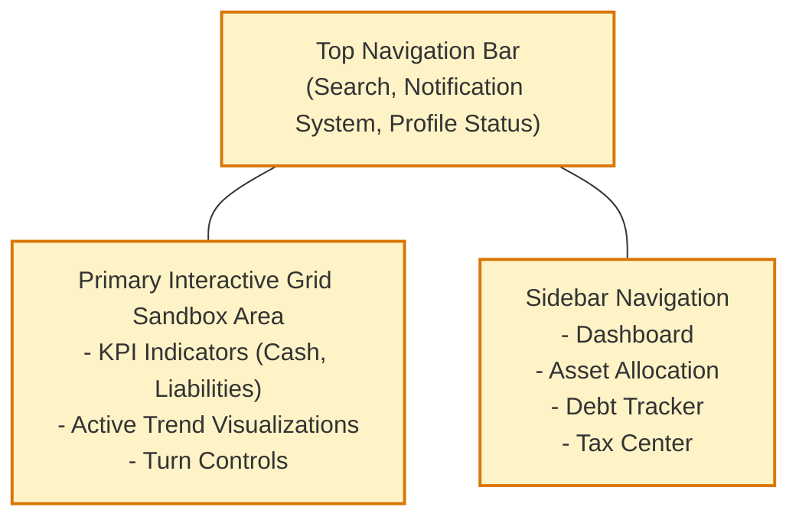
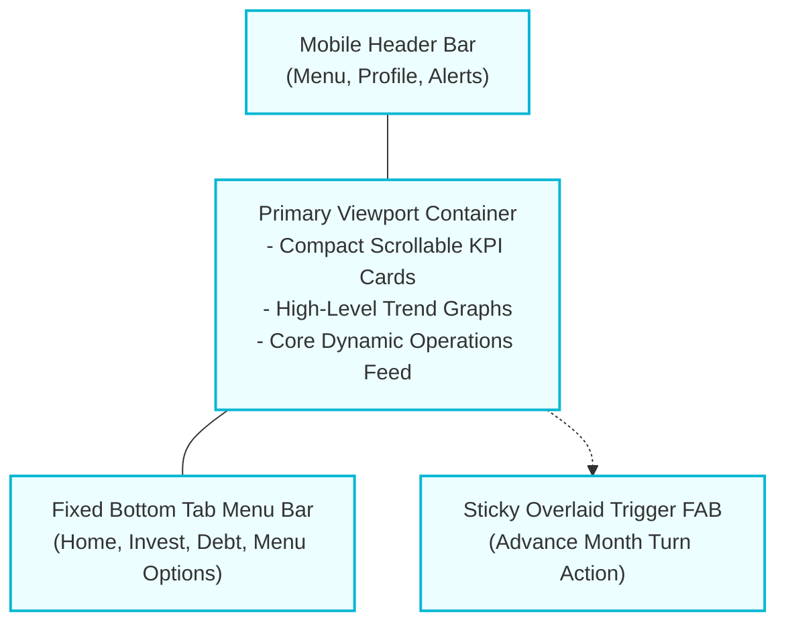
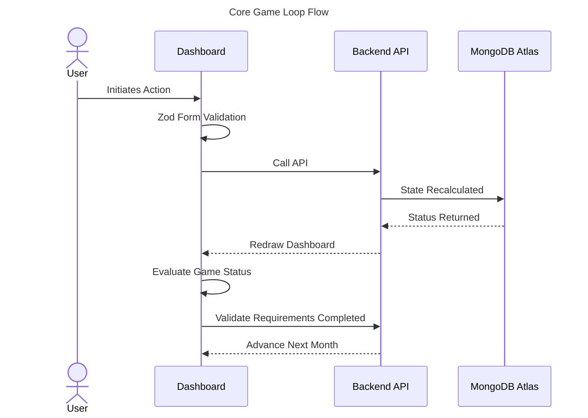
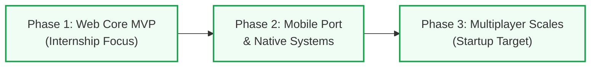

# Financial Literacy Simulator: Phase-Wise Development Plan

> **Note to the Engineering Team:** This is a living execution document. It defines *how* we build the simulator, step by step. Do not rewrite architecture here; follow the established `docs/architecture/MASTER_PLAN.md` as the source of truth for *what* we are building.

---

# Section 1: Product Vision

## Product Vision
To eradicate financial illiteracy by providing a safe, hyper-realistic, and deeply engaging simulated environment where individuals can experience the lifelong consequences of their financial decisions without real-world risk.

## Mission
To transform complex, intimidating financial concepts (compound interest, tax slabs, debt traps, and fraud) into intuitive, experiential learning loops accessible to anyone with a smartphone or web browser.

## Goals
- **Educational:** Increase the user's practical understanding of Indian personal finance by 50% (measured via pre/post assessments).
- **Behavioral:** Instill long-term habits of emergency fund creation and disciplined SIP investing.
- **Technical:** Deliver a robust, deterministically tested mathematical engine that accurately mirrors real-world economic realities.

## Target Audience
- **Primary:** High school and college students (16-24 years) entering the workforce.
- **Secondary:** Young professionals (25-35 years) struggling with debt management and early-career financial planning.

### Socio-Economic Framework and Demographic Modeling
**Purpose**: To design an educational system that addresses financial behavior, the simulator's computational frameworks must be built on the demographic realities of its target user base. 

**Design Rationale**: National surveys conducted by the National Centre for Financial Education (NCFE) indicate that while the general literacy rate in India has reached approximately 75%, the baseline financial literacy rate remains at only 27%. This knowledge gap is highly stratified by region, gender, and socio-economic background. Financial literacy drops to 24% in rural areas, 24% among women, and 21% among rural women.

At the same time, national inclusion initiatives have rapidly integrated the population into the formal banking system. Over 58 crore Jan Dhan accounts have been opened, with four-fifths situated in semi-urban or rural areas and 55% owned by women. This rapid digitization has pushed the Reserve Bank of India (RBI) Financial Inclusion Index to 67, signaling high access alongside low financial capability. This mismatch exposes first-time digital users to substantial financial risks, as they often lack the skills to evaluate products or spot digital fraud.

To model these challenges, the simulator structures its starting conditions around three distinct financial archetypes defined in national research.

| Demographic Archetype | Starting Assets (₹) | Starting Debt / Liabilities (₹) | Regular Monthly Income (₹) | Inherent Behavioral Biases |
| :--- | :--- | :--- | :--- | :--- |
| **The Student** | Cash: 15,000 | Education Loan: 3,50,000 | Stipend: 5,000 | Hyperbolic Discounting: High propensity to prioritize short-term lifestyle consumption over early-stage debt repayment. |
| **The New Entrant** | Cash: 50,000 | Credit Card Debt: 45,000 | Salary: 65,000 | Herding Behaviors: Strong tendency to copy peers by investing in speculative, high-frequency instruments. |
| **The Farmer / Gig Worker** | Cash: 20,000 | Informal Lender Debt: 1,20,000 | Variable Harvest: 18,000 (Avg) | Loss and Ambiguity Aversion: Rejection of structured savings and insurance products, viewing premiums as net losses. |

## Behavioral Design Mechanics
**Purpose**: The simulator's core mechanics are designed to counter three primary behavioral biases that prevent sustainable household wealth accumulation.

**1. Loss Aversion and Ambiguity Avoidance**
In agricultural and rural settings, households tend to hold capital-guaranteed instruments, such as gold, real estate, and fixed deposits, while actively avoiding diversified equities. Research in rural regions shows that 68% of farmers reject crop insurance, framing the recurring premium payments as a certain "loss" rather than a risk-mitigation strategy. The simulator implements this by letting users experience crop-failure or health-hazard events that wipe out non-insured capital, demonstrating the mathematical utility of risk-shifting mechanisms.

**2. Hyperbolic Discounting**
Low-income cohorts consistently prioritize short-term consumption over long-term security. For instance, roughly 73% of low-income earners opt for immediate lump-sum withdrawals from provident funds instead of securing structured, long-term annuities. The simulator penalizes high-discounting behaviors by introducing progressive mid-life inflation and health-care cost spikes that severely punish players who fail to build compound-interest engines in early game years.

**3. Herding Behaviors**
The rapid proliferation of simplified trading applications and social media forums has catalyzed speculative trading among novice investors. The simulator replicates this by generating localized "hot-asset bubbles" (e.g., speculative meme-tokens or unregulated chit funds). It utilizes a randomized decay algorithm where players who herd without analyzing underlying cash flows suffer severe capital losses.

## Target Platforms
Both platforms are treated as first-class citizens:
- **Web Application:** A responsive Single Page Application (SPA) providing a comprehensive desktop-grade dashboard and marketing landing pages.
- **Mobile Application:** A native (or cross-platform) mobile experience focusing on daily engagement, push notifications, and quick on-the-go decisions.

## Success Metrics
- **Acquisition:** 10,000 registered users in the first 3 months post-launch.
- **Activation:** 60% of registered users complete the onboarding and simulate their first 5 game years.
- **Retention:** 20% Day-30 retention (significantly outperforming traditional EdTech).
- **Impact:** 80% of users report feeling "more confident" about managing real-world money.

## Business Goals
- Prove the concept and validate the educational effectiveness during the initial MVP phase.
- Secure seed funding based on engagement metrics to build the full Multiplayer/AI ecosystem.
- Eventually explore B2B partnerships with universities and banks for white-labeled financial literacy modules.

## Core Features
- Deterministic 600-month (50-year) financial simulation engine.
- Dynamic income, tax (Indian slabs), and debt amortization calculations.
- Random "Hazard" events based on real-world NCFE data (e.g., medical emergencies, QR code scams).
- Historical net worth and cash-flow tracking via interactive charts.

## MVP Scope (Internship Deliverable)
- Single-player experience.
- Web application only (responsive for mobile browsers).
- Core math engine, basic static events, and 3-tier tax slabs.
- *Preserved from existing MVP constraints:* Must be a stable, stateful, time-based web app. All AI and multiplayer deferred.

## Future Scope (Startup Vision)
- Multiplayer Co-Op (Household management).
- Generative AI Financial Coach (LLM integration).
- Native Mobile App (iOS/Android).
- Dynamic Macro-Economy (inflation, market crashes).
- Global Asset Marketplace (simulated real estate, peer-to-peer trading).

---

# Section 2: Platform Strategy

## Overview
The layout system scales across desktop web layouts and mobile screens dynamically using Tailwind CSS responsive utilities.

## Responsive Layout System & Accessible Interface Design

### 1. Web Layout (Desktop / Tablet)

*Purpose: Outlines the spatial distribution of UI elements for wide screens.*
*Design Decisions: Employs a dense data layout optimized for long engagement times.*

### 2. Mobile Layout (iOS / Android)

*Purpose: Outlines the mobile-optimized vertical structure.*
*Design Decisions: Uses a sticky Bottom Tab and FAB (Floating Action Button) to keep navigation and core actions within thumb reach.*

## 3. Global UI Containers

### Cards
- Used to encapsulate distinct pieces of information (e.g., a specific Loan or a Net Worth summary).
- Must have consistent padding (`p-4` or `p-6`), rounded corners (`rounded-xl`), and subtle shadows (`shadow-sm`) to elevate them from the background.

### Tables vs. Lists
- **Web:** Uses standard Data Tables for historical transactions.
- **Mobile:** Tables are anti-patterns on mobile. They will be transformed into vertical, touch-friendly "Card Lists" where each row becomes a stacked card.

### Dialogs & Bottom Sheets
- **Web:** Interactions requiring focus (e.g., buying a stock) open in a centered Modal Dialog with a darkened backdrop.
- **Mobile:** The exact same interaction opens in a Bottom Sheet that slides up, making it easier to reach the inputs with one hand.

## 4. Notifications (Global State)
- **Toast Notifications:** Ephemeral, auto-dismissing popups (e.g., "Successfully invested ₹5000 in SIP") appearing at the bottom-center of the screen.
- **Interrupts:** Full-screen overlays for critical game events (e.g., "You have been fired!") that require immediate user acknowledgement.

---

# Section 9: Design System

## Overview
To maintain a high-quality, startup-grade aesthetic across Web and Mobile, we will build a centralized Design System. This ensures that every developer uses the exact same colors, typography, and spacing without writing custom CSS.

## 1. Typography and Visual Styling System
To build a professional, cohesive interface, developers must use the centralized design tokens defined below instead of inline styles or hardcoded CSS.

| Token Group | Specific Token | Value Specification | Design Context |
| :--- | :--- | :--- | :--- |
| **Typography Family** | Font Primary | `Inter, system-ui, sans-serif` | Used for UI copy, menus, and labels to ensure readability. |
| **Typography Family** | Font Tabular Data | `JetBrains Mono, Fira Code` | Used for numeric lists and tables to ensure digits align vertically. |
| **Semantic Theme** | Brand Base | `#0f172a` (slate-900) | Primary color used to establish a stable visual weight. |
| **Semantic Theme** | Base Interface Core | `#4f46e5` (indigo-600) | Accent color used for buttons and active states. |
| **Semantic Theme** | Success Indicator | `#10b981` (emerald-500) | Indicates profitable growth, incoming revenue, and positive outcomes. |
| **Semantic Theme** | Hazard Warning | `#f43f5e` (rose-500) | Indicates cash losses, growing debt, and hazard events. |
| **UI Spacing Standard** | Spacing Factor | Multiples of 4px | Spacing values are defined as multiples of 4px to maintain layout alignment. |
| **Accessible Ratio** | Accessibility Target | WCAG AA Compliant | Ensures a contrast ratio of at least 4.5:1 for standard text. |

## 3. Spacing & Grid
- **Spacing Scale:** Standard 4px baseline grid (e.g., `p-1` = 4px, `p-4` = 16px).
- **Border Radius:** Generous rounding to feel modern and friendly (`rounded-xl` for cards, `rounded-full` for buttons).

## 4. Core Components & Viewport Adaptation
To maintain a high-quality user experience, components adapt based on the user's viewport:
- **Grid Systems vs. Vertical Cards:** High-density grids on desktop convert to vertically stacked, scrollable cards on mobile to reduce horizontal clutter.
- **Data Tables vs. Detail Lists:** Desktop tables displaying transaction histories render as collapsible, touch-friendly list items on mobile devices.
- **Center Modals vs. Slide-up Sheets:** Interactions requiring user confirmation use centered modals on desktop and slide-up bottom sheets on mobile to keep inputs within thumb reach.

## 5. Animations & Micro-Interactions
To make the application feel "alive", we will implement:
- **Number Tickers:** When Net Worth changes, the number counts up/down rapidly rather than snapping instantly (via `react-spring` or `framer-motion`).
- **Page Transitions:** Subtle fade-in/slide-up when navigating between routes.
- **Haptic Feedback:** On mobile, completing an action (like paying a bill) triggers a slight vibration.

## 6. Accessibility & Theming
- **Dark Mode:** Supported out-of-the-box. All Tailwind classes must include dark variants (e.g., `bg-white dark:bg-gray-800`).
- **Contrast:** All text must pass WCAG AA contrast ratios.
- **Screen Readers:** Generous use of `aria-labels`, especially on icon-only buttons.

---

# Section 10: Application Flows

## Overview
This section models how the user moves between the screens defined in Section 7. Mapping these flows explicitly ensures that there are no dead-ends and that the user's journey is always purposeful.

## Application State Transitions & Execution Flows
**Purpose**: Details the state transition pathways and system interactions that drive the core game loop.


*Purpose: Demonstrates the cyclical update of the simulation state.*

### 1. User Authentication Transitions
- **Initiation:** The user enters credentials on `/auth/login` or completes the OTP step on `/auth/verify-email`.
- **Verification:** The API checks the inputs. If successful, it writes the access token to the client app's memory and sets the HTTP-only refresh token in the browser.
- **Routing Logic:**
  - If `isFirstLogin` is true, the user is redirected to the `/onboarding` onboarding flow.
  - If `isFirstLogin` is false, the user is redirected to `/dashboard` to continue their game state.

### 2. Onboarding Initialization Flow
- **State Locking:** If a user attempts to access `/dashboard` while their database record has `onboardingComplete: false`, the router blocks the request and redirects them to `/onboarding`.
- **Onboarding Setup:** The user completes the 6-step setup process.
- **Save Baseline State:** The client POSTs the setup inputs to the backend. The API builds the initial Month 1 game state document and updates the profile's `onboardingComplete` flag to true, unlocking `/dashboard`.

### 3. Core Simulation Flow (The Main Game Loop)
- **User Action:** While on `/dashboard`, the player can buy assets, repay loans, or configure insurance coverage.
- **Submit API Request:** The client triggers an action, which goes through standard input validation:
```typescript
const allocateSchema = zod.object({
  instrumentId: zod.enum(['FIXED_DEPOSIT', 'MUTUAL_FUND', 'STOCK_PORTFOLIO']),
  amountPaisa: zod.number().positive().int(), // Enforce integer-based math calculations
});
```
- **Update State:** If valid, the backend updates the database in a transaction and returns the new state, updating the dashboard display.
- **Trigger Next Month:** The user clicks "Advance Month".
- **System Processing:** The engine locks state inputs, processes recurring changes (interest, salaries, taxes), runs a random number generator to check for hazard events, and increments the simulation month.
- **Hazard Triggered:** The engine returns the next month's state with an active hazard event, opening the blocking Event Modal Dialog.
- **No Hazard:** The engine returns the updated monthly state, and the dashboard redraws the new cash balances.

### 4. End-of-Game Flow
- **Final Turn Evaluation:** When processing a turn, the system checks the active index. If `month_index` reaches 600, it sets the `isGameComplete` status flag to true.
- **Redirect to Summary:** The router blocks further access to standard control screens and redirects the client to `/reports/summary` to display the end-of-game report card.
- **Restart Loop:** When the user clicks "Play Again", the client requests a reset. The API clears the active state and sets the timeline back to Month 1, redirecting the user back to `/dashboard`.

### 5. Security Flows: Session Expiration Interceptor
- **Automatic Expiry:** If the access token expires, client requests fail with a 401 Unauthorized status code.
- **Session Refresh Integration:** The client interceptor pauses outgoing requests and calls the refresh endpoint:
```typescript
axiosInstance.interceptors.response.use(
  (response) => response,
  async (error) => {
    const originalRequest = error.config;
    if (error.response.status === 401 && !originalRequest._retry) {
      originalRequest._retry = true;
      try {
        await axios.post('/api/auth/refresh');
        return axiosInstance(originalRequest);
      } catch (refreshError) {
        window.location.href = '/auth/login?reason=timeout';
        return Promise.reject(refreshError);
      }
    }
    return Promise.reject(error);
  }
);
```

# Section 11: Feature Breakdown

## Overview
This section deconstructs the product into distinct features, prioritizing what must be built now (MVP) versus what is deferred to the startup phase (Future).

## 1. Core Simulation Engine (The Math)
**Purpose**: The core simulation loop advances month-by-month over a maximum 50-year (600-month) timeline.
**Design Decisions**: To ensure educational value and strict repeatability, the math engine operates deterministically. It avoids floating-point compounding errors by executing calculations in integer-based paisa units before formatting the outputs for the client layer.

### Systematic Investment Plan (SIP) Compounding
Standard wealth-building screens utilize a geometric compounding formula to project and execute monthly mutual fund acquisitions. To prevent the inflated projections common in simple linear calculators, the engine models compounding monthly using the exact geometric rate of return:

$$M = P \cdot \frac{(1+i)^n - 1}{i} \cdot (1+i)$$
Where:
- $M$ represents the final simulated maturity value.
- $P$ represents the recurring monthly SIP contribution.
- $n$ represents the total number of simulated investment months ($n = \text{Years} \times 12$).
- $i$ represents the exact monthly rate of return, derived geometrically from the annual expected return rate $R$ to guarantee annual compounding parity:
$$i = (1 + R)^{\frac{1}{12}} - 1$$
If the system utilized the simpler arithmetic division $i = R / 12$, a projected $12\%$ annual return would incorrectly resolve to $1\%$ monthly, leading to an artificially inflated maturity balance over long-term multi-decade simulation runs.

### Reducing-Balance Loan Amortization
Debt assets (such as education loans, home loans, and credit card balances) are amortized dynamically each month. The Equated Monthly Installment ($EMI$) is calculated using the reducing-balance methodology:

$$EMI = \frac{P \cdot r \cdot (1+r)^n}{(1+r)^n - 1}$$
Where:
- $P$ is the outstanding principal of the loan.
- $r$ is the monthly interest rate expressed as a decimal ($R_{\text{annual}} / 1200$).
- $n$ is the remaining repayment tenure in months.

For every month $t$ in the simulation, the engine executes a three-part calculation to update the outstanding debt balance:
$$\text{Interest Portion } (I_t) = B_{t-1} \cdot r$$
$$\text{Principal Portion } (PRN_t) = EMI - I_t$$
$$\text{Remaining Balance } (B_t) = \max\left(0, B_{t-1} - PRN_t\right)$$
Where $B_{t-1}$ is the outstanding balance of the previous month. This calculation shows players that early-stage payments go primarily toward interest rather than principal reduction.

### Reducing-Balance Depreciation
Physical assets (such as vehicles or agricultural machinery) lose value over time. The engine calculates this using the reducing-balance depreciation formula, applying a fixed annual percentage rate to the asset's net book value:

$$D_y = NBV_{y-1} \cdot d$$
$$NBV_y = NBV_{y-1} - D_y$$
Where:
- $D_y$ represents the depreciation expense applied during year $y$.
- $NBV_{y-1}$ is the Net Book Value of the asset at the beginning of year $y$.
- $d$ is the constant annual depreciation rate (e.g., $0.25$ for vehicles).

### Indian Income Tax Engine & Section 87A Marginal Relief
The simulator features a detailed replication of the Indian direct tax system, executing calculations based on the provisions of the Income Tax Act. The default computational pathway leverages the New Tax Regime, modeled on the tax brackets:

| Taxable Income Brackets (₹) | Applicable Tax Rate (%) |
| :--- | :--- |
| 0 to 4,00,000 | 0% (NIL) |
| 4,00,001 to 8,00,000 | 5% |
| 8,00,001 to 12,00,000 | 10% |
| 12,00,001 to 16,00,000 | 15% |
| 16,00,001 to 20,00,000 | 20% |
| 20,00,001 to 24,00,000 | 25% |
| Above 24,00,000 | 30% |

For salaried players, the engine automatically applies a standard deduction of ₹75,000 under the New Tax Regime, reducing their gross simulated salary accordingly.

Under the New Tax Regime, resident individuals with a net taxable income not exceeding ₹12,00,000 are eligible for a complete tax rebate under Section 87A up to a maximum limit of ₹60,000. This rebate reduces their net tax liability to zero. However, this rebate structure creates a severe "tax cliff" immediately above the ₹12,00,000 threshold. 

To address this, the engine implements the Central Board of Direct Taxes (CBDT) Marginal Relief formula:
$$T_{\text{payable}} = \min\left(T_{\text{normal}}, \text{Net Taxable Income} - 12,00,000\right)$$
Where $T_{\text{normal}}$ is the total tax computed using the standard slab rates prior to the application of any rebate or health and education cess.

**Tax Liabilities and Marginal Relief Example:**
| Gross Income (₹) | Standard Deduction (₹) | Net Taxable Income (₹) | Normal Tax (Tnormal) (₹) | Marginal Relief Allowed (₹) | Net Tax Payable (with 4% Cess) (₹) | Effective Take-Home Income (₹) |
| :--- | :--- | :--- | :--- | :--- | :--- | :--- |
| 12,00,000 | 0 | 12,00,000 | 60,000 | Section 87A Rebate | 0 | 12,00,000 |
| 12,75,000 | 75,000 | 12,00,000 | 60,000 | Section 87A Rebate | 0 | 12,75,000 |
| 12,10,000 | 0 | 12,10,000 | 61,500 | 51,500 | 10,400 | 11,99,600 |
| 12,50,000 | 0 | 12,50,000 | 67,500 | 17,500 | 52,000 | 11,98,000 |
| 12,70,000 | 0 | 12,70,000 | 70,500 | 500 | 72,800 | 11,97,200 |
| 12,75,000 | 0 | 12,75,000 | 71,250 | 0 | 74,100 | 12,00,900 |
| 14,00,000 | 0 | 14,00,000 | 90,000 | 0 | 93,600 | 13,06,400 |

## 2. The Digital Hazard Engine: Simulating Digitized Vulnerability
**Purpose**: With the explosive growth of the Unified Payments Interface (UPI), digital payment scams have become the foremost threat to consumer protection in India. The simulator implements a dynamic "Hazard Engine" that forces players to navigate realistic transaction screens.

### Common Hazard Scenarios
- **UPI Collect Request Scam:** Triggered during standard monthly bill payment steps, this scenario sends a fake "payment request" push notification. The player must reject the incoming request. Clicking "Accept" or entering a PIN results in an immediate loss of ₹10,000 to ₹50,000 from their cash balance.
- **Phishing / QR Code Scam:** Occurs when players attempt to sell crops or assets on simulated online peer-to-peer marketplaces. The player must decline transactions that require scanning a QR code to "receive" funds. Failure to spot the scam leads to a 30% depletion of linked bank accounts.
- **Predatory Instant Loan Apps:** Automatically triggered when a player's cash reserves drop below zero. The application presents quick-access loans with hidden, compounding weekly interest rates that exceed 36% per annum, demonstrating the risk of informal debt traps.
- **Mule Account Recruitment:** Models a scenario where players are offered regular payouts to route third-party transfers through their accounts. Accepting this triggers a regulatory audit, asset freezes, and an immediate credit score deduction of 200 points, illustrating current security monitoring tools like MuleHunter.AI.

## 3. Web Dashboard (SPA)
- **Purpose:** Allows users to view their state and make financial decisions.
- **Business Value:** The primary user interface for the internship evaluation.
- **Dependencies:** Backend REST API.
- **Complexity:** High (requires complex state management and Recharts).
- **Status:** **MVP (P0)**

## 4. Push Notifications System
- **Purpose:** Alerts users to pending simulated bills to build daily habits.
- **Business Value:** The primary driver for Day-30 retention.
- **Dependencies:** Mobile App, Expo Push Server.
- **Complexity:** Medium (requires scheduling cron jobs on the backend).
- **Status:** **Future (P1)**

## 5. Multiplayer (Household Mode)
- **Purpose:** Allows two users to link their accounts and make joint financial decisions.
- **Business Value:** Introduces social virality and models realistic family dynamics.
- **Dependencies:** WebSockets, Redis (for distributed locks).
- **Complexity:** Extremely High (state sync across multiple clients is notoriously difficult).
- **Status:** **Future (P2)**

## 6. Generative AI Financial Coach
- **Purpose:** An LLM chatbot that explains *why* the user's Net Worth dropped, without giving explicit financial advice.
- **Business Value:** Replaces static tooltips with personalized, contextual education.
- **Dependencies:** OpenAI API / LangChain, RAG architecture.
- **Complexity:** High (requires strict prompt engineering to prevent hallucinations and legal liability).
- **Status:** **Future (P2)**

## 7. Global Asset Marketplace
- **Purpose:** Real-time simulated stock market where user decisions influence asset prices.
- **Business Value:** Teaches supply/demand and market volatility.
- **Dependencies:** Multiplayer Architecture.
- **Complexity:** High.
- **Status:** **Future (P3)**


# Section 12: Development Roadmap

## Overview
The development plan structures releases into progressive, manageable phases to control costs and support scaling.

### Product Phasing, Feature Prioritization & Monolith-to-Distributed Roadmap

*Purpose: Outlines the strategic rollout progression.*

**Phase 1: Web Core MVP (Internship Focus):** Prioritizes deploying a stable, single-player web dashboard SPA using Vite and React. The server-side components run as a modular monolith, storing states in a single-collection MongoDB Atlas free instance.
**Phase 2: Mobile Integration and Native Features:** Migrates core screens to React Native (via Expo). This phase introduces native system alerts to simulate banking app push notifications and leverages secure hardware storage for biometric authentication.
**Phase 3: Scaled Multiplayer Ecosystem (Startup Target):** Introduces cooperative household mode, enabling multiple users to manage shared budgets, debt, and long-term financial goals in a unified simulation space.

### Implementation Priority
| Product Feature | Implementation Priority | Key Technical Dependencies | Rollout Phase |
| :--- | :--- | :--- | :--- |
| Deterministic Calculations (Math Engine) | P0 (Critical) | Core TypeScript Libraries | Phase 1: Web Core MVP |
| Indian Tax Engine & Section 87A Relief | P0 (Critical) | Math Engine Library | Phase 1: Web Core MVP |
| Single-Collection Storage Schema | P0 (Critical) | MongoDB Connection Layer | Phase 1: Web Core MVP |
| JWT Session Engine with RTR Security | P0 (Critical) | Core Cryptography Libraries | Phase 1: Web Core MVP |
| Web Dashboard Interface SPA | P0 (Critical) | React 18 / Zustand Framework | Phase 1: Web Core MVP |
| Dynamic Hazard Event Dispatcher | P1 (High) | Core Math Calculation Services | Phase 1: Web Core MVP |
| React Native Native App Shell | P1 (High) | Expo Platform Configuration | Phase 2: Mobile Integration |
| System Billing Notifications | P2 (Medium) | Server-side Cron Jobs / Expo Push SDK | Phase 2: Mobile Integration |
| Cooperative Joint Households | P3 (Future) | Redis Locking Engine / WebSockets | Phase 3: Multiplayer Ecosystem |
| AI Personal Finance Advisor | P3 (Future) | LLM API Integration Layer | Phase 3: Multiplayer Ecosystem |

## Phase 0: Foundation & Engineering Setup

## Why
Before writing any feature code, the team must have a standardized, reproducible development environment. Inconsistent environments lead to "it works on my machine" bugs, which will derail our internship timeline. 

## Objectives
- Establish the Monorepo folder structure.
- Configure local development tooling (Docker, Local MongoDB).
- Enforce code quality via automated linting and formatting.
- Establish the CI/CD pipeline for automated testing.

## Scope
This phase covers zero product features. It is strictly limited to repository initialization, tool configuration, and process documentation.

## Deliverables
- `package.json` configurations for both `/client` and `/server`.
- `docker-compose.yml` for Local MongoDB (MongoDB Atlas).
- GitHub Actions workflow file (`.github/workflows/ci.yml`).
- ESLint and Prettier configuration files.
- `README.md` and `CONTRIBUTING.md` setup instructions.

## Dependencies
- Approval of this execution plan.
- Creation of the GitHub Repository.

## Backend
- Initialize Node.js + Express + TypeScript in the `/server` directory.
- Configure `tsconfig.json` for strict type-checking.
- Setup `jest` for backend unit testing.

## Frontend
- Initialize React + Vite + TypeScript in the `/client` directory.
- Configure TailwindCSS.
- Setup `vitest` for frontend testing.

## Database
- Configure Local MongoDB in `docker-compose.yml` to simulate MongoDB Atlas locally.
- Write a simple initialization script to create the `fls_main_collection` in Local MongoDB on container startup.

## UI / UX
- *Not applicable for this phase.*

## Risks
- **Technical Risk:** Docker/Local MongoDB issues on Windows machines (if any interns use Windows).
  - *Mitigation:* Document WSL2 setup steps meticulously in `CONTRIBUTING.md`.
- **Schedule Risk:** Spending too much time debating ESLint rules.
  - *Mitigation:* Use standard industry presets (e.g., `eslint-config-prettier`) and move on.

## Testing
- Verify that `npm run test` executes successfully in both client and server directories.
- Verify that GitHub Actions successfully runs the test suite on a test PR.

## Definition of Done
- Any developer on the team can clone the repo, run `docker-compose up`, and `npm start` without any errors.
- CI/CD pipeline is active and blocking merges on lint/test failures.

## Milestone
**Milestone 1:** Project Foundation Complete.

### Team Allocation

Backend
- Initialize Node/Express/TS scaffolding.
- Configure Docker and Local MongoDB.

Frontend
- Initialize React/Vite scaffolding.
- Configure TailwindCSS and ESLint.

UI/UX
- *No tasks assigned.*

Documentation
- Write `CONTRIBUTING.md` with local setup instructions.

Testing
- Configure GitHub Actions CI workflow.

Estimated Duration: 3 Days
Completion Criteria: Successful CI pipeline run on `main`.

---

# Phase 1: UI / UX Foundation

## Why
A simulator lives or dies by its interface. Before any backend logic is hooked up, the frontend must have a cohesive design system. Building the UI components early ensures that when the backend APIs are ready, the frontend developers only need to map data rather than design layouts from scratch.

## Objectives
- Establish the visual language (Design System, Typography, Colors).
- Build the core reusable React Component Library.
- Map out the Information Architecture and Screen Inventory.
- Develop static wireframes for the main Dashboard.

## Scope
This phase focuses entirely on the visual presentation and frontend component structure. No backend APIs will be built or connected during this phase.

## Deliverables
- Tailwind CSS configuration (`tailwind.config.js`) matching the color palette.
- Reusable UI Components: Buttons, Modals, Forms, Sliders, Cards.
- Static prototype of the main Financial Dashboard.
- Defined User Journey maps for Onboarding and Monthly Decisions.

## Dependencies
- Phase 0 (Foundation Setup) must be complete.

## Backend
- *Not applicable for this phase.*

## Frontend
- Create the `/components` directory structure.
- Build the atomic UI components (Buttons, Inputs, Typography).
- Build the composite components (Decision Panel, KPI Cards).
- Ensure all components are fully responsive (Mobile First).

## Database
- *Not applicable for this phase.*

## UI / UX
- **Design Philosophy:** Clean, modern, "FinTech" aesthetic. Avoid overly playful/childish game UI; it must look like a serious financial tool to build trust.
- **Color Palette:** 
  - Primary: Deep Trust Blue.
  - Success/Assets: Forest Green.
  - Danger/Debt: Alert Red.
  - Background: Off-white/Light Gray to reduce eye strain during long sessions.
- **Accessibility:** Ensure high contrast ratios for text and colorblind-safe palettes for charts.

## Risks
- **Design Paralysis:** Spending too much time debating button border-radius rather than building.
  - *Mitigation:* Use an existing headless UI library (e.g., Radix UI, shadcn/ui) as a base.
- **Scope Creep:** Designing screens that are not required for the MVP.
  - *Mitigation:* Strictly adhere to the core MVP Screen Inventory list.

## Testing
- Visual regression testing (or manual UI review) across Mobile, Tablet, and Desktop breakpoints.
- Ensure all interactive elements have focus states for keyboard navigation.

## Definition of Done
- All primary UI components are built and viewable in a sandbox (e.g., a static `/styleguide` route).
- A static version of the main Dashboard is built and fully responsive.

## Milestone
**Milestone 2:** UI/UX Foundation Complete.

### Team Allocation

Backend
- *No tasks assigned.*

Frontend
- Configure Tailwind theme.
- Build React Component Library (Buttons, Cards, Sliders).
- Build Static Dashboard Layout.

UI/UX
- Define Color Palette and Typography.
- Create Wireframes (Figma/Excalidraw).
- Map User Journey (Onboarding -> Gameplay -> Game Over).

Documentation
- Document the Component Library usage in `/client/README.md`.

Testing
- Verify responsive breakpoints manually.

Estimated Duration: 4 Days
Completion Criteria: Static dashboard approved by the Product Manager.

---

# Phase 2: Simulation Core

## Why
The Simulation Core is the absolute brain of this project. If the financial math is incorrect, the educational value is zero. By building the core engine as a pure, isolated module before hooking it up to a database or HTTP server, we guarantee that the math is 100% testable and completely agnostic of the infrastructure.

## Objectives
- Build the pure mathematical engine (`SimulationEngine`).
- Define the exact JSON schema for `PlayerState` and `Decisions`.
- Implement the exact business rules extracted from the NCFE research (Taxes, SIPs, EMIs).
- Create a deterministic Random Event Generator for life hazards.

## Scope
This phase focuses exclusively on the backend `engine/` directory. There is NO database integration and NO network request handling. It is purely data-in, data-out logic.

## Deliverables
- `PlayerState` and `Decision` TypeScript interfaces.
- `loop.ts`: The main monthly progression function.
- `math.ts`: Compound interest and tax utility functions.
- `events.ts`: The static hazard event dictionary and probability roller.
- 100% Jest Unit Test coverage on all engine files.

## Dependencies
- NCFE Research documents mapping tax brackets and fraud scenarios.

## Backend
- Write pure TypeScript functions that accept an `OldState` and `Decisions`, and return a `NewState`.
- Implement integer math (all currency handled in paise/cents) to avoid floating-point rounding errors.
- Implement constraint checks (e.g., triggering auto-debt if Cash drops below zero).

## Frontend
- *Not applicable for this phase.*

## Database
- *Not applicable for this phase.*

## UI / UX
- *Not applicable for this phase.*

## Risks
- **Technical Risk:** Floating-point math errors compounding over 600 simulated months.
  - *Mitigation:* Strictly enforce integer-only math for all currency fields.
- **Logic Risk:** Incorrect implementation of Indian Tax Slabs.
  - *Mitigation:* Hardcode a simplified, 3-tier tax slab logic and cover every boundary condition with unit tests.

## Testing
- **Unit Testing:** This phase requires extreme test-driven development (TDD). 
- Write tests that simulate 50 years (600 months) of compound interest to verify the math holds up without crashing or drifting.
- Write tests forcing negative cash balances to ensure the Auto-Debt business rule triggers correctly.

## Definition of Done
- The `SimulationEngine` can take a starting state and process 600 months of decisions correctly.
- Jest test suite reports 100% coverage on the `engine/` directory.

## Milestone
**Milestone 3:** Simulation Core Complete.

### Team Allocation

Backend
- Define TS Interfaces (`PlayerState`, `Events`).
- Implement `math.ts` (Compound Interest, Taxes, Amortization).
- Implement `events.ts` (RNG Hazard Logic).
- Implement `loop.ts` (The master state transition function).

Frontend
- *No tasks assigned.*

UI/UX
- *No tasks assigned.*

Documentation
- Document the exact formulas used in `SIMULATION_RULES.md`.

Testing
- Write Jest Unit tests for every mathematical boundary condition.

Estimated Duration: 5 Days
Completion Criteria: `npm run test` passes with 100% coverage on the engine module.

---

# Phase 3: Backend Development

## Why
With the `SimulationEngine` proven and tested, the system needs an API layer to expose this logic to the internet and a persistence layer to save user progress. This phase builds the REST API and the database connections that will eventually power the frontend dashboard.

## Objectives
- Build the Express.js server and REST API endpoints.
- Implement JWT-based Authentication.
- Integrate MongoDB Atlas (via Local MongoDB) using Single-Collection Design.
- Connect the `SimulationEngine` to the API layer using Services and Controllers.

## Scope
This phase covers the entire Node.js/Express infrastructure. It stops at the API boundary; no frontend integration occurs here.

## Deliverables
- `auth` controller (`/register`, `/login`).
- `simulation` controller (`/state`, `/advance-month`, `/history`).
- MongoDB Atlas Repositories for fetching/saving User and State objects.
- Zod validation schemas for all incoming POST requests.
- API Documentation (e.g., Swagger/OpenAPI spec or Postman Collection).

## Dependencies
- Phase 2 (Simulation Core) must be complete.
- Local MongoDB container must be running (Phase 0).

## Backend
- Setup Express Router and modularize routes.
- Implement Middleware for JWT verification and global error handling.
- Write MongoDB Atlas Mongoose models to perform `GetItem`, `PutItem`, and `Query`.
- **The Orchestration Flow:** The `/advance-month` route must: 
  1. Fetch `OldState` from DB.
  2. Pass `OldState` to `SimulationEngine`.
  3. Save `NewState` to DB.
  4. Return `NewState` to the client.

## Frontend
- *Not applicable for this phase.*

## Database
- Create the local MongoDB Atlas collections.
- Define the Partition Key (`PK`) and Sort Key (`SK`) patterns in the repository code.

## UI / UX
- *Not applicable for this phase.*

## Risks
- **Security Risk:** Users modifying the JSON payload to artificially inflate their Net Worth.
  - *Mitigation:* The backend MUST fetch the "current cash" from the trusted database, not rely on what the client sends. The client only sends *decisions* (e.g., "Invest 500"), and `Zod` validates that `500` is a positive integer less than or equal to their actual cash.
- **Data Loss Risk:** Overwriting the state without saving history.
  - *Mitigation:* Ensure every `/advance-month` call writes to both the `STATE` record and appends a `HISTORY#<month>` record in MongoDB Atlas.

## Testing
- Integration Testing: Use `Supertest` to simulate HTTP requests against the Express app and verify 200 OK or 400 Bad Request responses.
- Ensure Zod correctly rejects malformed JSON payloads.

## Definition of Done
- A developer can use Postman to register an account, fetch their state, and successfully advance the simulation by 1 month.
- All API routes return the correct HTTP status codes.

## Milestone
**Milestone 4:** Backend APIs Complete.

### Team Allocation

Backend
- Build Express App, Routes, and Middleware.
- Implement JWT Auth.
- Write MongoDB Atlas Repositories.
- Connect Controllers to the `SimulationEngine`.

Frontend
- *No tasks assigned.*

UI/UX
- *No tasks assigned.*

Documentation
- Update `API_SPECIFICATION.md` with final request/response payloads.

Testing
- Write `Supertest` integration tests for all API endpoints.

Estimated Duration: 5 Days
Completion Criteria: Successful Postman flow from Registration to 3 months of simulation advancement.

---

# Phase 4: Frontend Development

## Why
With the backend APIs live, the UI/UX components built in Phase 1 must now be wired up to real data. This phase transforms the static dashboard into a fully functional Single Page Application where users can log in, see their state, and make financial decisions.

## Objectives
- Integrate React Router for navigation between Auth, Dashboard, and Reports.
- Build the API Client (`axios` interceptors for JWT injection).
- Connect the React Context provider to manage the global `PlayerState`.
- Implement `Recharts` to draw the historical Net Worth progression.

## Scope
This phase covers data fetching, state management, and chart rendering on the client side.

## Deliverables
- Fully functional Login / Registration flows.
- Populated KPI Dashboard (Cash, Assets, Liabilities).
- Interactive Decision Form (Sliders/Inputs for allocating budget).
- Responsive Line Chart displaying the array returned by `/api/simulation/history`.

## Dependencies
- Phase 1 (UI Components) must be complete.
- Phase 3 (Backend APIs) must be deployed locally or stubbed.

## Backend
- *Not applicable for this phase.*

## Frontend
- Set up an `AuthContext` to hold the JWT in memory (or secure `localStorage`).
- Create custom hooks (e.g., `useSimulation()`) to abstract API calls away from the UI components.
- Wire up the Event Modal: When `/advance-month` returns an `eventTriggered` object, display a popup describing the hazard (e.g., "Medical Emergency") before refreshing the dashboard numbers.

## Database
- *Not applicable for this phase.*

## UI / UX
- Handle loading states gracefully (Skeleton loaders during API calls).
- Handle error states gracefully (Toast notifications for 400 Bad Request if the user tries to overspend).

## Risks
- **State De-sync Risk:** The UI displaying outdated numbers after an action.
  - *Mitigation:* Ensure that every successful `/advance-month` response completely overwrites the global `PlayerState` context, triggering a top-down re-render.
- **Chart Performance Risk:** Rendering 600 data points on a mobile device may cause lag.
  - *Mitigation:* Use `Recharts` with data downsampling if the array exceeds 100 points.

## Testing
- **E2E Testing:** Use Cypress or Playwright to test the full flow: Login -> View Dashboard -> Advance Month -> See updated Chart.
- Test responsive layout on actual mobile devices using local network hosting.

## Definition of Done
- A user can log in, allocate funds, click "Advance Month", see a loading spinner, and watch their Net Worth chart update in real-time.
- No console errors exist.

## Milestone
**Milestone 5:** Frontend Interactive MVP Complete.

### Team Allocation

Backend
- *No tasks assigned.*

Frontend
- Wire up Axios interceptors and Auth logic.
- Implement React Context for global state.
- Integrate Recharts and bind historical data.
- Handle Loading and Error UI states.

UI/UX
- Review the implemented UI against the original Phase 1 Figma designs.

Documentation
- *No tasks assigned.*

Testing
- Write Cypress E2E tests for the core gameplay loop.

Estimated Duration: 5 Days
Completion Criteria: Successful E2E test run on the frontend repository.

---

# Phase 5: Integration

## Why
While the frontend and backend have been built and tested in isolation, the point where they connect is where 90% of critical bugs occur. Integration testing ensures that the UI correctly maps the actual JSON payloads returned by the server, rather than relying on mocked data.

## Objectives
- Remove all mock data from the Frontend React application.
- Ensure the Frontend correctly handles and visualizes the Backend's Random Events.
- Verify CORS configuration allows communication between the Vite dev server and Express.
- Audit the end-to-end performance of a full simulation run (from Month 1 to Month 600).

## Scope
This phase focuses on cross-boundary communication. No net-new features should be built here; the goal is stabilization and connection.

## Deliverables
- A fully integrated, playable loop running on Local MongoDB and local Docker containers.
- Performance audit report identifying any bottlenecks in the `advance-month` API.
- Fixed CORS policies in the Express middleware.

## Dependencies
- Phase 3 (Backend) and Phase 4 (Frontend) must be complete.

## Backend
- Configure CORS to accept requests from the frontend origin.
- Ensure all environment variables (e.g., JWT secrets) are properly documented in `.env.example`.

## Frontend
- Delete all local JSON mock files.
- Ensure the Global Context seamlessly handles the `403 Forbidden` response if a JWT expires, correctly redirecting the user to the Login screen.

## Database
- *Not applicable for this phase.*

## UI / UX
- Review the End-of-Game screens (Bankruptcy and Retirement). Ensure they trigger correctly when the backend API rejects further advancement.

## Risks
- **CORS Errors:** The most common blocker during integration.
  - *Mitigation:* Explicitly whitelist the frontend dev port (usually `localhost:5173`) in the Express setup.
- **Payload Mismatches:** Backend changes a key from `cash` to `currentCash` breaking the frontend.
  - *Mitigation:* Share a single `types/` folder between the `/client` and `/server` in the monorepo to enforce contract consistency.

## Testing
- Conduct full manual exploratory testing of the entire game loop.
- Run Cypress E2E tests against the live local backend rather than mocked network routes.

## Definition of Done
- A user can register, play 600 months, and retire without experiencing a single console error, network failure, or UI desync.

## Milestone
**Milestone 6:** Full System Integration Complete.

### Team Allocation

Backend
- Configure CORS and security headers (Helmet).
- Monitor server logs during frontend integration to catch payload issues.

Frontend
- Purge mock data.
- Handle JWT expiration edge cases.

UI/UX
- Perform a UX audit on the live, integrated application.

Documentation
- *No tasks assigned.*

Testing
- Execute manual end-to-end tests covering all edge cases (Bankruptcy, Retirement, 100% savings, 100% debt).

Estimated Duration: 3 Days
Completion Criteria: Flawless execution of the 600-month game loop on a local machine.

---

# Phase 6: Testing & Quality Assurance

## Why
Financial software requires zero tolerance for mathematical drift or data corruption. While unit tests were written during earlier phases, this phase focuses on adversarial testing: trying to deliberately break the game through edge cases, extreme user inputs, and simulating years of gameplay in seconds.

## Objectives
- Conduct deep Simulation Testing (running bots through the engine).
- Perform Load / Performance Testing on the API.
- Execute Security Testing against the JWT and payload validation.
- Bug fixing and stabilization ahead of deployment.

## Scope
No new features are permitted. The entire team shifts to a Quality Assurance (QA) mindset. Every bug found must be ticketed, triaged, and fixed.

## Deliverables
- Comprehensive Test Report (Unit, Integration, E2E results).
- Automated bot scripts capable of playing 50 years in <1 second.
- Resolved bug tickets for all `P0` (Critical) and `P1` (High) issues.

## Dependencies
- Phase 5 (Integration) must be 100% complete and merged to `main`.

## Backend
- Run load testing tools (e.g., `k6` or `Artillery`) against the `/advance-month` endpoint.
- Verify MongoDB Atlas throttling limits are not hit during rapid API calls.

## Frontend
- Run Lighthouse audits. Ensure Performance, Accessibility, and Best Practices scores are all >90.
- Verify the UI does not crash if the backend returns a 500 Internal Server Error.

## Database
- Verify that orphaned data is not being created (e.g., historical snapshots without an associated User Profile).

## UI / UX
- Test the application on actual mobile devices (iOS Safari, Android Chrome). Ensure sliders and touch targets are responsive and thumb-friendly.

## Risks
- **Testing Fatigue:** Developers testing their own code often miss obvious bugs.
  - *Mitigation:* Enforce cross-testing. The frontend developer tests the backend API using Postman; the backend developer tests the UI using Cypress.
- **Edge Case Crashes:** What happens if a user allocates 0 to everything for 600 months?
  - *Mitigation:* The automated simulation bots must run millions of random permutations to find crashes.

## Testing
- **Unit Testing:** Maintain 100% on `engine/`.
- **Integration Testing:** Maintain API route coverage.
- **E2E Testing:** Execute Cypress suites against a staging environment.
- **Simulation Testing:** Execute "Monte Carlo" style bot scripts against the `SimulationEngine`.

## Definition of Done
- All automated tests pass in the CI/CD pipeline.
- Lighthouse scores >90.
- Zero known `P0` or `P1` bugs remain open in the issue tracker.

## Milestone
**Milestone 7:** Release Candidate 1 (RC1) Approved.

### Team Allocation

Backend
- Write and execute API load tests (`k6`).
- Fix any `P0`/`P1` backend bugs discovered.

Frontend
- Execute Lighthouse audits and fix accessibility issues.
- Fix any `P0`/`P1` UI bugs discovered.

UI/UX
- Perform Mobile Device testing.

Documentation
- Draft the Release Notes for RC1.

Testing
- Write automated "Bot" scripts to stress-test the `SimulationEngine` with random decisions.

Estimated Duration: 4 Days
Completion Criteria: Zero critical bugs remaining; team sign-off on RC1.

---

# Phase 7: Deployment

## Why
A local application is invisible to the internship evaluators. We must move the MVP from our local machines to the open internet in a secure, scalable, and cost-effective manner.

## Objectives
- Containerize the Backend Node.js application via Docker.
- Compile and bundle the Frontend React application.
- Deploy the MongoDB Atlas collection to production.
- Set up domain routing and SSL certificates.

## Scope
This phase transitions the system from Local MongoDB to production services (Vercel/Render).

## Deliverables
- `Dockerfile` for the Node.js backend.
- Deployed frontend accessible via a public URL (e.g., `https://simulator.example.com`).
- Deployed backend accessible via a public URL (e.g., `https://api.simulator.example.com`).
- Live production MongoDB Atlas collection.

## Dependencies
- Phase 6 (QA) must be completed. RC1 must be tagged in Git.

## Backend
- Update the AWS SDK configuration in the codebase to use production credentials (via IAM Roles, NOT hardcoded keys) instead of pointing to `localhost:4566`.
- Deploy the Docker container to Render or ECS.

## Frontend
- Run `npm run build` to generate the production optimized static bundle.
- Deploy the `/dist` folder to Supabase Storage and place Vercel (CDN) in front of it.
- Update the Axios base URL to point to the production API.

## Database
- Provision a real MongoDB Atlas collection via the MongoDB Atlas Console or Terraform.
- Ensure On-Demand capacity is selected to minimize idle costs.

## UI / UX
- *Not applicable for this phase.*

## Risks
- **Deployment Costs:** Leaving infrastructure running post-internship can accrue massive AWS bills.
  - *Mitigation:* Document teardown scripts. Set AWS Billing Alarms to trigger at $10.
- **Environment Variable Leaks:** Accidentally committing production `.env` files to GitHub.
  - *Mitigation:* Double-check `.gitignore`. Use GitHub Secrets for CI/CD injection.

## Testing
- Perform a "Smoke Test" on the live production URL to ensure the database connection works and static assets load quickly.

## Definition of Done
- The internship evaluators can access the application from their own laptops without needing to install any software.
- The repository's `main` branch automatically deploys to production upon push.

## Milestone
**Milestone 8:** Project Live.

### Team Allocation

Backend
- Write `Dockerfile`.
- Provision Render and MongoDB Atlas collection.
- Configure AWS IAM Policies.

Frontend
- Configure Supabase Storage and Vercel.
- Handle production environment variables.

UI/UX
- *No tasks assigned.*

Documentation
- Write the final Internship Presentation referencing the live URL.

Testing
- Execute the production Smoke Test.

Estimated Duration: 2 Days
Completion Criteria: Live public URL shared with the internship evaluators.

---

# Phase 8: Post Internship Roadmap

## Why
With the internship successfully completed and graded, the team can pivot the MVP into a legitimate startup product. This phase outlines the "cool" features that were deliberately deferred to protect the initial timeline.

## Objectives
- Integrate Large Language Models (LLMs) to serve as a personalized AI Financial Coach.
- Implement Multiplayer architecture (Co-Op households).
- Transition from static Random Events to a dynamic Macro-Economy simulation.
- Introduce an Asset Marketplace for realistic stock trading and real estate.

## Scope
This phase represents the next 6-12 months of startup development. It requires significant architectural shifts, including WebSockets and Redis.

## Deliverables
- Pitch Deck for seed funding based on MVP metrics.
- AI Storyteller module built with LangChain / OpenAI API.
- Global Leaderboard and Economy microservices.

## Dependencies
- Phase 7 (Deployment) and the successful completion of the internship.

## Backend
- **Multiplayer Migration:** Introduce WebSockets (Socket.io or API Gateway WebSockets) to sync state between two users playing as a "Household" (e.g., Husband and Wife).
- **Caching:** Introduce Redis to handle real-time locking so both players must confirm their monthly decisions before the engine ticks.

## Frontend
- Build a chat interface for the "AI Coach" using a streaming text response component.
- Build the Global Marketplace screens.

## Database
- Refactor the MongoDB Atlas single-collection design to support `HOUSEHOLD` partition keys instead of individual `USER` keys.

## UI / UX
- Redesign the Dashboard to accommodate dual-player metrics.

## Risks
- **LLM Hallucinations:** The AI Coach giving genuinely bad financial advice.
  - *Mitigation:* The LLM must be strictly prompted to *explain* the math, never to prescribe investment strategies. It must run in a highly constrained RAG (Retrieval-Augmented Generation) pipeline.
- **WebSocket Scaling:** Handling thousands of concurrent TCP connections.
  - *Mitigation:* Rely on managed services like AWS API Gateway WebSockets rather than self-hosting a massive Redis pub/sub cluster early on.

## Testing
- Introduce chaos testing to handle dropped WebSocket connections gracefully.

## Definition of Done
- The simulator is no longer a single-player calculator, but a massive multiplayer ecosystem where players can compare their Net Worth and consult an AI for learning.

## Milestone
**Milestone 9:** Seed Funding Pitch.

### Team Allocation

Backend
- Prototype the WebSocket architecture.
- Integrate the OpenAI API.

Frontend
- Build the AI Chat Interface.
- Build Multiplayer Lobbies.

UI/UX
- Design the Multiplayer Dashboard.

Documentation
- Draft the Startup Pitch Deck.

Testing
- Evaluate LLM responses for safety and accuracy.

Estimated Duration: 3 - 6 Months
Completion Criteria: The project evolves into a fully-fledged EdTech product.

---

# Section 13: Team Planning & Execution

## Overview
A flawless plan is useless without rigorous execution. This section defines how the founding engineering team will operate, communicate, and ensure high-quality output throughout the phases defined in Section 12.

## 1. Roles & Responsibilities
To prevent bottlenecks, domain responsibilities are strictly siloed, but cross-testing is enforced.

- **Backend Tasks:** Database modeling, API route creation, Zod schema validation, Core Math Engine implementation.
- **Frontend Tasks:** Component building (React/Vite), global state management (Zustand), API integration (Axios), charting (Recharts).
- **UI/UX Tasks:** Figma design token management, mobile layout optimization, SVG illustrations, CSS Tailwind configuration.
- **Testing Tasks:** Cypress E2E flows, Jest unit tests for the math engine, manual QA on target devices.
- **Documentation Tasks:** API Swagger docs, architecture diagrams, and updating this Blueprint.

## 2. Sprint Planning
We will execute this project following the Scrum framework customized for async collaboration:
- **Sprints:** 2-week timeboxes.
- **Tracking:** GitHub Projects (Kanban board) with columns: `To Do`, `In Progress`, `In Review`, `Done`.
- **Tickets:** Every task must be converted into a GitHub Issue before work begins. No code is written without a ticket.

## 3. Communication Strategy
- **Async First:** All technical decisions, blockers, and bug reports must be documented in GitHub Issues, not lost in Slack/Discord chats.
- **Daily Sync:** A 15-minute daily standup (synchronous or async text) answering: What did you do? What are you doing? Are you blocked?

## 4. Branch Strategy
- `main`: Production-ready code only. Highly protected. Deploys automatically to AWS.
- `develop`: Integration branch. The default target for all new features.
- `feature/<ticket-number>-<short-desc>`: Created off `develop` for active work (e.g., `feature/42-auth-api`).
- `fix/<ticket-number>-<short-desc>`: Created off `develop` for bug fixes.

## 5. Review Process
1. Developer opens a Pull Request (PR) from `feature/*` against `develop`.
2. GitHub Actions automatically runs Prettier, ESLint, and Jest Unit Tests.
3. PR must be reviewed and approved by at least **one other engineer** on the team.
4. Reviewer checks for: Logic errors, missing tests, architectural violations, and adherence to the Definition of Done.
5. Once approved and CI passes, the PR is squashed and merged.

## 6. Definition of Done (DoD)
A feature or phase is NOT complete until it meets the following criteria:
1. Code is merged into `develop`.
2. 0 ESLint warnings or errors.
3. 100% unit test coverage for any code touching the `SimulationEngine`.
4. Feature has been manually tested on both a Desktop Browser and a Mobile Device.
5. UI passes Lighthouse accessibility audits (>90 score).

## 7. Milestones
- **Milestone 1:** Engineering Foundation (Phase 0)
- **Milestone 2:** UI Design System (Phase 1)
- **Milestone 3:** Math Engine Complete (Phase 2)
- **Milestone 4:** Backend APIs Complete (Phase 3)
- **Milestone 5:** Frontend Connected (Phase 4)
- **Milestone 6:** Full System Integration (Phase 5)
- **Milestone 7:** Release Candidate 1 (RC1) Approved (Phase 6)
- **Milestone 8:** Project Live (MVP Complete) (Phase 7)
- **Milestone 9:** Seed Funding Pitch (Phase 8)


# Section 14: Summary of Architectural Best Practices
To deliver an educational tool that effectively teaches real-world financial skills, developers must combine mathematical accuracy, system security, and intentional behavioral mechanics:

- **Implement Practical Behavioral Mechanics:** Rather than relying on simple text explanations, the system forces players to experience the direct, compounding consequences of common cognitive biases, such as loss aversion and hyperbolic discounting.
- **Ensure Accurate Tax Engine Calculations:** The math engine must accurately mirror current direct tax codes, including New Tax Regime brackets, standard deductions, and Section 87A marginal relief calculations. This helps players develop practical, transferrable financial planning skills.
- **Maintain Strict Data Integrity and Performance:** Grouping user profiles, active states, and historical snapshots into a single polymorphic MongoDB collection eliminates relational joins, keeping read/write response times under ten milliseconds.
- **Balance Security with User Experience:** The platform applies secure session policies, including Argon2id password hashing and rotating refresh tokens, while grace windows prevent minor mobile network drops from logging out legitimate users.
- **Incorporate Realistic Digital Safety Scenarios:** By integrating simulation-based "Hazard Events" that mimic current UPI and QR code scams, the platform teaches digital financial safety alongside traditional wealth management principles. This approach helps build digital resilience and trust in formal financial institutions.