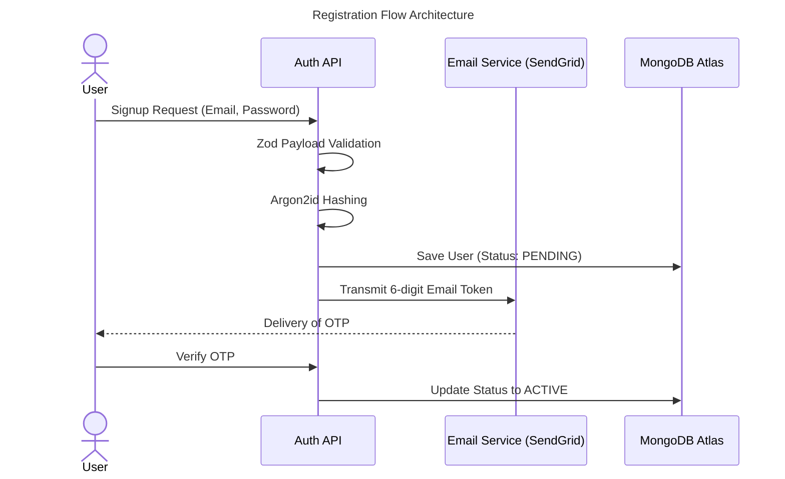
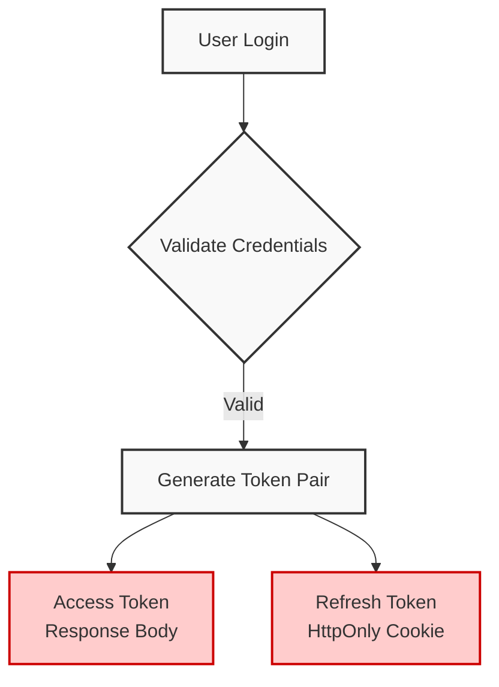
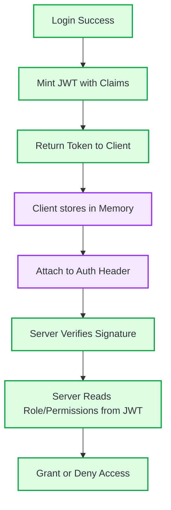
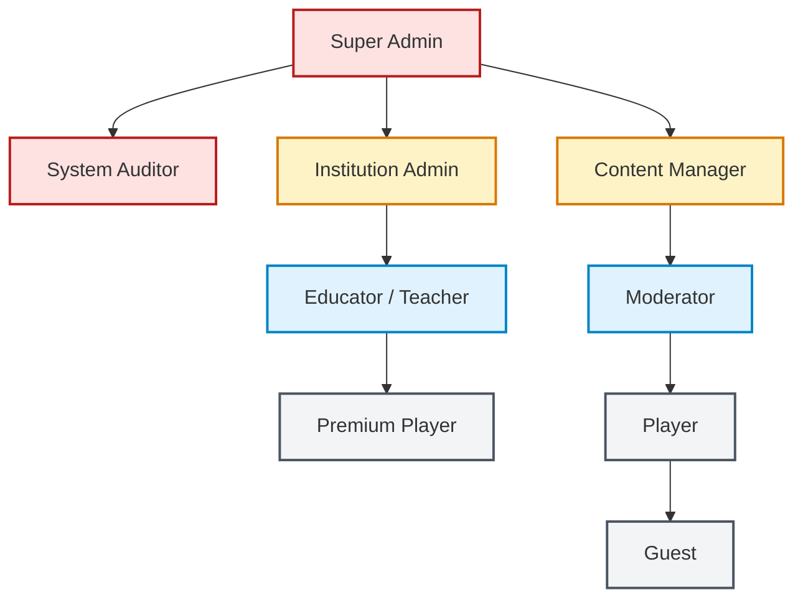
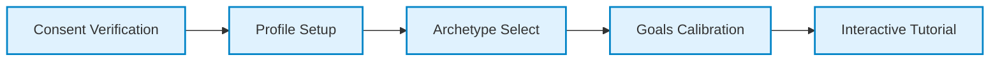
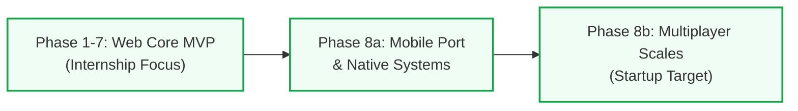

# Financial Literacy Simulator: Phase-Wise Development Plan

> **Note to the Engineering Team:** This is the canonical engineering source of truth for the Financial Literacy Simulator. It defines *what* we are building and *how* we build it, from product vision through architecture, implementation, deployment, and future scaling. Supplementary research, NCFE analysis, and competitor benchmarks are archived in `docs/research/`. This document takes precedence over all other planning artifacts.

---

# Section 1: Product Vision

## Product Vision
To eradicate financial illiteracy by providing a safe, hyper-realistic, and deeply engaging simulated environment where individuals can experience the lifelong consequences of their financial decisions without real-world risk.

## Mission
To transform complex, intimidating financial concepts (compound interest, tax slabs, debt traps, and fraud) into intuitive, experiential learning loops accessible to anyone with a smartphone or web browser.

## Goals
- **Educational:** Increase the user's practical understanding of Indian personal finance by 50% (measured via pre/post assessments).
- **Behavioral:** Instill long-term habits of emergency fund creation and disciplined SIP investing.
- **Technical:** Deliver a robust, deterministically tested mathematical engine that accurately mirrors real-world economic realities.

## Target Audience
- **Primary:** High school and college students (16-24 years) entering the workforce.
- **Secondary:** Young professionals (25-35 years) struggling with debt management and early-career financial planning.

### Socio-Economic Framework and Demographic Modeling
**Purpose**: To design an educational system that addresses financial behavior, the simulator's computational frameworks must be built on the demographic realities of its target user base. 

**Design Rationale**: National surveys conducted by the National Centre for Financial Education (NCFE) indicate that while the general literacy rate in India has reached approximately 75%, the baseline financial literacy rate remains at only 27%. This knowledge gap is highly stratified by region, gender, and socio-economic background. Financial literacy drops to 24% in rural areas, 24% among women, and 21% among rural women.

At the same time, national inclusion initiatives have rapidly integrated the population into the formal banking system. Over 58 crore Jan Dhan accounts have been opened, with four-fifths situated in semi-urban or rural areas and 55% owned by women. This rapid digitization has pushed the Reserve Bank of India (RBI) Financial Inclusion Index to 67, signaling high access alongside low financial capability. This mismatch exposes first-time digital users to substantial financial risks, as they often lack the skills to evaluate products or spot digital fraud.

To model these challenges, the simulator structures its starting conditions around three distinct financial archetypes defined in national research.

| Demographic Archetype | Starting Assets (₹) | Starting Debt / Liabilities (₹) | Regular Monthly Income (₹) | Inherent Behavioral Biases |
| :--- | :--- | :--- | :--- | :--- |
| **The Student** | Cash: 15,000 | Education Loan: 3,50,000 | Stipend: 5,000 | Hyperbolic Discounting: High propensity to prioritize short-term lifestyle consumption over early-stage debt repayment. |
| **The New Entrant** | Cash: 50,000 | Credit Card Debt: 45,000 | Salary: 65,000 | Herding Behaviors: Strong tendency to copy peers by investing in speculative, high-frequency instruments. |
| **The Farmer / Gig Worker** | Cash: 20,000 | Informal Lender Debt: 1,20,000 | Variable Harvest: 18,000 (Avg) | Loss and Ambiguity Aversion: Rejection of structured savings and insurance products, viewing premiums as net losses. |

## Behavioral Design Mechanics
**Purpose**: The simulator's core mechanics are designed to counter three primary behavioral biases that prevent sustainable household wealth accumulation.

**1. Loss Aversion and Ambiguity Avoidance**
In agricultural and rural settings, households tend to hold capital-guaranteed instruments, such as gold, real estate, and fixed deposits, while actively avoiding diversified equities. Research in rural regions shows that 68% of farmers reject crop insurance, framing the recurring premium payments as a certain "loss" rather than a risk-mitigation strategy. The simulator implements this by letting users experience crop-failure or health-hazard events that wipe out non-insured capital, demonstrating the mathematical utility of risk-shifting mechanisms.

**2. Hyperbolic Discounting**
Low-income cohorts consistently prioritize short-term consumption over long-term security. For instance, roughly 73% of low-income earners opt for immediate lump-sum withdrawals from provident funds instead of securing structured, long-term annuities. The simulator penalizes high-discounting behaviors by introducing progressive mid-life inflation and health-care cost spikes that severely punish players who fail to build compound-interest engines in early game years.

**3. Herding Behaviors**
The rapid proliferation of simplified trading applications and social media forums has catalyzed speculative trading among novice investors. The simulator replicates this by generating localized "hot-asset bubbles" (e.g., speculative meme-tokens or unregulated chit funds). It utilizes a randomized decay algorithm where players who herd without analyzing underlying cash flows suffer severe capital losses.

## Target Platforms
Both platforms are treated as first-class citizens:
- **Web Application:** A responsive Single Page Application (SPA) providing a comprehensive desktop-grade dashboard and marketing landing pages.
- **Mobile Application:** A native (or cross-platform) mobile experience focusing on daily engagement, push notifications, and quick on-the-go decisions.

## Success Metrics
- **Acquisition:** 10,000 registered users in the first 3 months post-launch.
- **Activation:** 60% of registered users complete the onboarding and simulate their first 5 game years.
- **Retention:** 20% Day-30 retention (significantly outperforming traditional EdTech).
- **Impact:** 80% of users report feeling "more confident" about managing real-world money.

## Business Goals
- Prove the concept and validate the educational effectiveness during the initial MVP phase.
- Secure seed funding based on engagement metrics to build the full Multiplayer/AI ecosystem.
- Eventually explore B2B partnerships with universities and banks for white-labeled financial literacy modules.

## Core Features
- Deterministic 600-month (50-year) financial simulation engine.
- Dynamic income, tax (Indian slabs), and debt amortization calculations.
- Random "Hazard" events based on real-world NCFE data (e.g., medical emergencies, QR code scams).
- Historical net worth and cash-flow tracking via interactive charts.

## MVP Scope (Internship Deliverable)
- Single-player experience.
- Web application only (responsive for mobile browsers).
- Core math engine, basic static events, and 3-tier tax slabs.
- *Preserved from existing MVP constraints:* Must be a stable, stateful, time-based web app. All AI and multiplayer deferred.

## Future Scope (Startup Vision)
- Multiplayer Co-Op (Household management).
- Generative AI Financial Coach (LLM integration).
- Native Mobile App (iOS/Android).
- Dynamic Macro-Economy (inflation, market crashes).
- Global Asset Marketplace (simulated real estate, peer-to-peer trading).

---

# Section 2: Platform Strategy

## Overview
To maximize reach and educational impact, the Financial Literacy Simulator adopts a multi-platform strategy. While the core mathematical engine (backend) is shared, the client-side experience is tailored to specific platforms. 

## Web Application (Primary Platform for MVP)
The web application serves two distinct purposes:
- **Marketing & Landing Pages:** Public-facing SEO-optimized pages designed to acquire users, explain the value proposition, and host the pitch deck/startup resources.
- **Simulation Dashboard (SPA):** The core authenticated experience. Optimized for longer, focused play sessions on desktop or tablet devices where users can analyze complex charts and data tables comfortably.
- **Progressive Web App (PWA):** As a future enhancement, the web app will be configured as a PWA, allowing users to "install" it on their desktop or Android devices for offline cache support.

## Mobile Application (Target for Seed Phase)
The mobile application is critical for establishing daily behavioral habits (e.g., checking emergency funds, responding to notifications).
- **Core Experience:** A focused, vertical layout prioritizing quick actions (e.g., swiping to pay a bill, tapping to view a simplified net-worth KPI). 
- **Push Notifications:** The primary driver for retention. The app will simulate real-time financial events (e.g., "Your credit card bill is due in 3 days!").
- **Biometric Security:** Leveraging FaceID/TouchID to reinforce the "real banking app" simulation.

## Admin Dashboard (Future Capability)
A restricted internal portal used by the founding team (and eventually B2B partners/teachers) to:
- Monitor aggregate user performance (e.g., "70% of players go bankrupt by month 40").
- Manage the Event Dictionary (injecting new fraud scenarios based on real-world news).
- Manage user accounts and support tickets.

## Platform Responsibilities
- **Backend (API):** The single source of truth. Handles all math, state transitions, and database queries. Completely platform-agnostic.
- **Web Client:** Handles detailed reporting, complex data visualization, and user acquisition (SEO).
- **Mobile Client:** Handles daily engagement, push notifications, and simplified decision-making.

## Shared vs. Specific Features

### Shared Features (Both Web and Mobile)
- Authentication (Login / Signup).
- Core Simulation Loop (Advancing months, making investments, paying debt).
- Leaderboards and Achievements.
- User Profile and Settings.

### Web-Specific Features
- Deep-dive Analytics (Multi-axis charts for 50-year projections).
- Admin Dashboard access.
- Marketing Landing Pages.

### Mobile-Specific Features
- Native Push Notifications.
- Biometric Login.
- "Swipe-to-invest" micro-interactions.
- Haptic feedback during major financial events (e.g., heavy vibration during a "Market Crash" or "Fraud" event).

---

# Section 3: Technology Strategy

## Overview
The technology stack is selected to optimize for developer velocity, strict type safety, and scalability. We are adopting a **TypeScript-first monorepo** approach. Sharing the same language across the frontend, mobile app, and backend reduces context switching and allows us to share interface definitions (e.g., the `PlayerState` JSON schema).

## Frontend (Web & Mobile)
- **Web Framework:** React 18+ (via Vite). Selected over Next.js because the core dashboard is a highly interactive, stateful SPA that does not require Server-Side Rendering (SSR) for SEO. 
- **Marketing Site:** A separate lightweight Next.js or Astro app strictly for SEO and fast page loads, distinct from the React SPA.
- **Mobile Framework:** React Native (Expo). Allows us to reuse up to 70% of the React web components and business logic while delivering native iOS/Android builds.
- **Styling:** Tailwind CSS. Enables rapid prototyping and maintains a strict, consistent design system across both web and mobile (via NativeWind).
- **State Management:** Zustand. Much lighter and less boilerplate-heavy than Redux, perfect for syncing the global simulation state.

## Backend
- **Framework:** Node.js with Express.js. 
- **Language:** TypeScript (Strict Mode).
- **Validation:** Zod. Crucial for validating incoming JSON payloads against our expected schemas before they touch the math engine.
- **Architecture:** Modular Monolith. The system is split logically into domains (Auth, Simulation, Users) but deployed as a single service for simplicity.

### Middleware Architecture & Authorization Pipeline
**Purpose**: Guarantees that every incoming API request is securely identified, validated, and authorized before touching business logic.

```mermaid
graph LR
    classDef req fill:#e0f2fe,stroke:#0284c7,stroke-width:2px;
    classDef guard fill:#fef3c7,stroke:#d97706,stroke-width:2px;
    classDef action fill:#dcfce3,stroke:#22c55e,stroke-width:2px;

    Req[Incoming Request]:::req --> AuthN[Authentication<br/>Verify JWT]:::guard
    AuthN --> AuthZ[Authorization<br/>Extract Role/Perms]:::guard
    AuthZ --> PermGuard[Permission Guard<br/>Require 'write:sim']:::guard
    PermGuard --> OwnerGuard[Resource Owner Guard<br/>Is this my data?]:::guard
    OwnerGuard --> Handler[Route Handler<br/>Business Logic]:::action
    Handler --> Audit[Audit Logger<br/>Record Action]:::action
```


*Purpose: Demonstrates the sequential defense-in-depth pipeline.*
*Data Flow: Requests must pass through a strict sequence of express middlewares before executing the controller logic.*

## Database & Storage
- **Primary Database:** MongoDB Atlas. A highly scalable NoSQL database. We will use a Single-Collection Design pattern to store Users, Profiles, and Historical Game States together to ensure single-digit millisecond latency.
- **Caching / Locking (Future):** Redis. Will be introduced when Multiplayer is built to handle distributed state locking (e.g., ensuring Player A and Player B both submit decisions before advancing the month).
- **Storage:** Supabase Storage. Used for storing user avatars and hosting the static frontend assets.

## Infrastructure & DevOps
- **Authentication:** JWT (JSON Web Tokens) with short-lived access tokens and HttpOnly refresh tokens.
- **Push Notifications:** Expo Push Notifications service (simplifies APNs/FCM integration).
- **Analytics:** PostHog. Selected for its ability to track detailed product usage funnels and feature flags natively.
- **Monitoring & Logging:** Sentry (for real-time error tracking and crash reports on mobile/web). Backend structured logs are streamed via Render's native log dashboard.
- **CI/CD:** GitHub Actions. Automated workflows to run ESLint, Jest tests, and trigger deployments on merge to `main`.
- **Deployment:** Render (for the Node.js backend container) and Vercel (for the static React frontend).
- **Version Control:** Git (GitHub).
- **Design Tools:** Figma (UI/UX) and Mermaid (Architecture Diagrams).

---

# Section 4: Authentication, Authorization & Security

## Overview
Because the Financial Literacy Simulator collects highly sensitive simulated financial behaviors, security must be bank-grade. We will implement a custom JWT-based authentication system rather than relying on heavy third-party providers (like Auth0) to keep costs near zero during the startup phase.

## Authentication Architecture
**Purpose**: Protect user progress and preserve leaderboard integrity. We utilize a secure authentication system built on standard JWT patterns and one-way password hashing.
**Security Considerations**: Designed to resist side-channel & GPU attacks while maintaining fast application response times.


*Purpose: Outlines the steps taken to verify a new user identity before establishing a permanent record.*
*Security Considerations: The system secures registration by requiring a 6-character OTP sent via secure SMTP services before changing the account status.*

### Dual-Token Lifecycle and Token Storage
To protect user sessions, the backend uses a dual-token JWT architecture:


*Purpose: Demonstrates the separation of token lifecycles.*
*Security Considerations: The short-lived access token expires after 15 minutes and is kept only in client memory to protect against XSS. The long-lived refresh token is an HttpOnly, Secure, SameSite=Strict cookie protecting against client-side scripts.*

### Refresh Token Rotation with Automatic Reuse Detection
To secure long-lived sessions, the platform uses Refresh Token Rotation (RTR) with automatic reuse detection. This strategy groups all tokens issued to a user session into a single tracking lineage defined by a `family_id`.

If a refresh token is reused (indicating a potential breach), the entire token family is revoked immediately:
```typescript
app.post('/auth/refresh', async (req, res) => {
  const refreshToken = req.cookies.refreshToken;
  // Verify token and check DB...
  if (tokenRecord.consumed) {
    // Reuse detected: Revoke the entire token family immediately
    await db.deleteMany({ familyId: tokenRecord.familyId });
    res.clearCookie('refreshToken');
    return res.status(401).json({ error: 'Security breach detected.' });
  }
  // Issue new pair and mark current as consumed...
});
```

## Authorization Architecture (RBAC)

**Authentication vs. Authorization:** While Authentication (AuthN) verifies *who* the user is, Authorization (AuthZ) verifies *what* the user is allowed to do. 

**Why RBAC?**
As the simulator evolves from a single-player MVP to a multiplayer educational platform used by schools, we must cleanly separate administrative powers from student powers. Role-Based Access Control (RBAC) maps permissions to predefined roles rather than directly to users, ensuring the system remains scalable.

### JWT Authorization Design
To ensure millisecond response times, the RBAC system avoids hitting the database on every request. Instead, it embeds authorization claims directly into the Access Token.


*Purpose: Outlines the stateless authorization lifecycle.*
*Design Decisions: Embedding permissions in the JWT prevents DB bottlenecks, but requires the token to be short-lived (15 mins) so revoked permissions propagate quickly.*

**JWT Embedded Claims Payload:**
- `userId`: Identifier for the resource owner check.
- `role`: The primary role (e.g., `PLAYER`).
- `permissions`: An array of granted actions (e.g., `['read:sim', 'write:sim']`).
- `sessionId`: For tracking global logouts.
- `tokenVersion`: Allows immediate invalidation of tokens if permissions change mid-session.
- `tenantId`: (Future) Associates the user with a specific school or institution.

## User Roles & Role Hierarchy
Roles are introduced progressively as the platform expands.


*Purpose: Demonstrates the hierarchical inheritance of permissions across roles.*

**Phase 1 (MVP) Roles:**
- **Guest:** Unauthenticated user. Can read marketing pages.
- **Player:** The standard authenticated user. Owns their simulation state.
- **Admin:** Internal team. Has global read/write access to user accounts and the hazard dictionary.

**Phase 2 Roles:**
- **Moderator:** Reviews multiplayer household names and handles basic support tickets.
- **Content Manager:** Updates the financial math constants, tax slabs, and hazard scenarios without touching user data.

**Phase 3 Roles (B2B Startup Target):**
- **Institution Admin:** A school principal or IT admin. Can manage Educators and global analytics for their specific `tenantId`.
- **Educator:** A teacher. Can view the progress of students within their assigned classroom.
- **Premium Player:** A user with a paid subscription, unlocking advanced AI coach features.

**Phase 4 Roles:**
- **Super Admin:** Ultimate root authority.
- **Support Engineer:** Can assume a user's session (Impersonation) to debug broken simulation states.
- **System Auditor:** Read-only access to all financial models and security logs.

## Permission Matrix & Resource Ownership
Access control requires mapping roles to specific actions. The following matrix defines baseline permissions.

| Domain Module | Player | Educator | Admin | Super Admin |
| :--- | :--- | :--- | :--- | :--- |
| **Authentication** | Login, Reset Password | Same as Player | Same as Player | Same as Player |
| **User Profile** | Edit Own Profile | Edit Own, View Student Profiles | View All | Edit All |
| **Simulation Core** | Read/Write Own Game | Read Own + Read Students | Read All | Full Access |
| **Investments/Debt** | Read/Write Own | Read Own + Read Students | Read All | Full Access |
| **Hazard Library** | Read Global Dictionary | Read Global Dictionary | Create, Edit, Delete | Full Access |
| **Tax Rules** | Read Global Logic | Read Global Logic | Edit Parameters | Full Access |
| **Leaderboards** | View Global & Friends | View Classroom Leaderboard | View All | View All |
| **Analytics/Reports** | View Own Reports | View Classroom Aggregates | View Global KPIs | Full Access |
| **Administration** | - | Manage Classroom Setup | Ban Users, Manage Events | Manage Roles, Billing |

### Resource Ownership Guards
Simply having the `write:sim` permission is insufficient. The middleware enforces Resource Ownership:
- **Rule 1:** A `PLAYER` can only `GET /api/simulation/state` if the `userId` in the JWT matches the `userId` of the requested simulation document.
- **Rule 2:** `PLAYER` A cannot modify `PLAYER` B's investments.
- **Rule 3:** An `EDUCATOR` can view multiple simulations, but *only* if those users belong to the Educator's `tenantId` (Classroom).
- **Rule 4:** `ADMIN` roles bypass standard ownership checks but are strictly recorded by the Audit Logger.

## Security Architecture

### Authenticated State Variables
| Storage Layer Location | Lifecycle Horizon | Exposing Targets | Defensive Countermeasures |
| :--- | :--- | :--- | :--- |
| **User Access Token** | 15 Minutes | Client memory space | Prevent local storage write-outs to stop XSS extraction. |
| **Refresh Identity Token** | 7 Days | Network Cookie Engine | Enforce SameSite=Strict, Secure, and HttpOnly attributes. |
| **Password Entropy Values** | Indefinite | Database Hash | Use Argon2id iterations to slow down GPU cracking. |
| **OTP Code** | 15 Minutes | External SMTP payload | Apply short expirations, single-use codes, and strict rate limits. |

### Data Protection
- **Password Hashing:** Passwords must be hashed using **Argon2** (preferred over Bcrypt for resistance to GPU cracking).
- **Password Salting:** A unique, cryptographically secure salt is generated per user and combined with the Argon2 hash.

### Argon2id Computational Parameters
Passwords are protected using Argon2id. Parameters are tuned to balance security and server performance:
```typescript
import argon2 from 'argon2';

const hashConfig = {
  type: argon2.argon2id,         // Resist side-channel & GPU attacks
  memoryCost: 65536,             // 64 MiB memory hardness
  timeCost: 3,                   // 3 iterations over memory lanes
  parallelism: 4,                // 4 parallel execution threads
  saltLength: 16,                // Minimum 128-bit unique salt value
  hashLength: 32,                // 256-bit output hash width
};
```

### API Protection
- **CORS:** Strictly configured to only allow requests from the exact frontend origin (`https://simulator.example.com`).
- **CSRF Protection:** Handled inherently by keeping the Access Token in memory and only using the HttpOnly cookie for the `/refresh` endpoint.
- **Rate Limiting:** IP-based rate limiting (e.g., 5 login attempts per minute) via an Express middleware (e.g., `express-rate-limit`) to prevent brute force attacks.
- **CAPTCHA:** Google reCAPTCHA v3 will be implemented on the Signup and Forgot Password routes to prevent bot spam.

### Account Lifecycle
- **Deactivate Account:** Soft delete. The `User` record in MongoDB Atlas is marked `isActive: false`. The user can log back in to reactivate.
- **Delete Account (GDPR/CCPA Compliance):** Hard delete. A background worker permanently scrubs the `User`, `Profile`, and all associated `History` records.

### Compliance & Tracking
- **Security Logs:** Failed login attempts and password changes are logged with the timestamp and IP address, surfaced via Sentry and Render's structured log stream.
- **Device Tracking:** (Future) When a new device logs in, an email alert ("New Login from Mac OS") is triggered.
- **Legal Policies:** Enforced checkboxes during signup for Privacy Policy, Terms of Service, and Cookie Policy.

---

# Section 5: Onboarding Experience

## Overview
The onboarding flow is the most critical funnel in the application. It bridges the gap between account creation and the first simulation tick. It must collect enough data to generate an accurate starting `PlayerState` while keeping friction low enough to prevent drop-off.

## The Onboarding Funnel (Step-by-Step)
**Purpose**: Manages account initialization, converting user inputs into an authenticated profile document and a baseline simulation state.


*Purpose: Outlines the sequential funnel to initialize a player's first simulation.*
*Data Flow: Proceeds strictly sequentially. Blocked until completion.*

### Step 1: Consent Verification
Explains the simulation's educational focus. The user must check standard terms and privacy checkboxes before starting.

### Step 2: Profile Setup
The user enters a nickname, selects an avatar icon, and chooses a language (e.g., English or Hindi).

### Step 3: Financial Archetype Selection
The player selects one of three core archetypes: Student, New Entrant, or Farmer. This selection sets the user's initial cash, debt balances, and baseline income.

### Step 4: Goals Calibration
The user adjusts sliders to customize their simulated age, risk tolerance (Conservative, Balanced, or Active), and long-term goal (e.g., Early Retirement or Home Ownership).

### Step 5: Notification Preferences (Crucial for Mobile)
Explains and requests permission to receive push notifications on mobile, which are used to simulate monthly billing alerts.

### Step 6: Interactive Tutorial
A step-by-step introduction where the system guides the user through making their first deposit and ending their first month.

## Technical Implementation Details
**Client-Side Flow Control via State Machine**
The onboarding flow uses an XState-based machine to handle back and forward transitions while preventing users from bypassing key setup steps.

```javascript
import { createMachine } from 'xstate';

const onboardingMachine = createMachine({
  id: 'onboarding',
  initial: 'consent',
  states: {
    consent: { on: { ACCEPT: 'profile' } },
    profile: { on: { NEXT: 'archetype', BACK: 'consent' } },
    archetype: { on: { SELECT: 'calibration', BACK: 'profile' } },
    calibration: { on: { SUBMIT: 'notifications', BACK: 'archetype' } },
    notifications: { on: { PERMIT: 'tutorial', SKIP: 'tutorial', BACK: 'calibration' } },
    tutorial: { on: { COMPLETE: 'simulationActive' } },
    simulationActive: { type: 'final' }
  }
});
```

When the tutorial concludes, the onboarding client registers the initialization parameters by dispatching a payload to the database:
```typescript
// Onboarding Initialization Structure (POST /api/users/onboard)
interface OnboardingPayload {
  userId: string;
  displayName: string;
  avatarId: string;
  language: 'EN' | 'HI';
  archetype: 'STUDENT' | 'NEW_ENTRANT' | 'FARMER';
  riskAppetite: 'CONSERVATIVE' | 'MODERATE' | 'AGGRESSIVE';
  primaryGoal: 'BUY_HOUSE' | 'RETIRE_EARLY' | 'CLEAR_DEBT';
  allowNotifications: boolean;
}
```

---

# Section 6: Information Architecture

## Overview
The Information Architecture (IA) defines the complete hierarchy and routing structure of the application across both web and mobile. It is intentionally shallow (maximum 3 clicks to reach any core feature) to ensure high engagement.

## Structured Information Architecture & System Routing
| Route Endpoint | Authentication Rules | UI Template Layout | Primary Functional Interface Component |
| :--- | :--- | :--- | :--- |
| `/about` | Unauthenticated | Static Marketing Frame | System objective models and educational methodology. |
| `/auth/login` | Unauthenticated | Standard Security Container | Standard login form. |
| `/auth/signup` | Unauthenticated | Standard Security Container | Standard signup form with password validation. |
| `/auth/verify-email` | Unauthenticated | Standard Security Container | Six-character email verification code entry. |
| `/onboarding` | Authenticated | Focused Wizard Page | Profile setup, archetype select, and initial calibration screens. |
| `/dashboard` | Authenticated (JWT Required) | Left-Sidebar Frame | Main page displaying the active game month and net worth indicators. |
| `/investments` | Authenticated (JWT Required) | Left-Sidebar Frame | Direct access panels to fixed deposits, stocks, and mutual funds. |
| `/debt` | Authenticated (JWT Required) | Left-Sidebar Frame | Credit lines, amortizing home loans, and repayment controls. |
| `/reports/tax` | Authenticated (JWT Required) | Left-Sidebar Frame | Displays annual tax estimations and standard deductions. |
| `/admin/events` | Admin Credentials Only | Standard Management Panel | Configuration controls for randomized scenario structures. |

## RESTful API Endpoints
The application uses clean, standard RESTful paths to make calls to resources, which maps to the endpoints handled by the Express routing components. Every protected endpoint is wrapped in the RBAC middleware chain.
- `GET /api/simulation/state`: Retrieves the player's financial parameters for the active month. **[Guards: RequireAuth, ResourceOwner]**
- `POST /api/simulation/turn`: Executes calculations and advances the simulation to the next month. **[Guards: RequireAuth, ResourceOwner]**
- `POST /api/simulation/investments/allocate`: Allocates a portion of cash reserves to a specified investment instrument. **[Guards: RequireAuth, RequirePermission('write:sim'), ResourceOwner]**
- `POST /api/simulation/debt/repay`: Process extra principal payments toward an active loan. **[Guards: RequireAuth, RequirePermission('write:sim'), ResourceOwner]**
- `POST /api/admin/hazards`: Creates a new digital hazard event. **[Guards: RequireAuth, RequireRole('ADMIN')]**

---

# Section 7: Screen Inventory

## Overview
This section details the functional requirements for the highest-priority screens. It defines exactly what UI components are needed, what backend APIs power them, and how they handle edge cases.

## Deep-Dive Screen Inventory & Functional Requirements
**Purpose**: Defines the structural requirements, API dependencies, and validation rules for the simulator's core layouts.

### 1. The Main Dashboard
**Objective:** Serves as the primary workspace hub, rendering a consolidated view of net worth and cash balances prior to initiating the next simulation turn.
**API Interactions:** Fetches the active status snapshot using `GET /api/simulation/state`.
**Required Layout Elements:**
- **Net Worth Display Panel:** An animated numeric display showing the current net worth.
- **Liquid Cash Panel:** Shows the available funds for discretionary actions.
- **Active Graph Overlay:** Displays the six-month trend line of assets versus liabilities.
- **Trigger Control (FAB):** Prominent button to end the current month.
**Validation Rules:** The turn button is disabled if there are unresolved hazard events or pending regulatory decisions.
**Error Handling:** A React boundary isolates rendering crashes, showing a fallback panel that lets the user restart the step.

### 2. Asset Allocation Panel
**Objective:** Allows players to purchase or redeem stocks, mutual funds, and fixed deposits.
**API Interactions:** Allocates or redrafts assets using `POST /api/simulation/investments/allocate`.
**Required Layout Elements:**
- **Instrument Tabs:** Categorized panels for Fixed Deposits, Mutual Funds, and Equity Lines.
- **Performance Chart:** Shows historical returns and projected growth over time.
- **Trade Controller Dialog:** Floating entry interface featuring numeric slider controls.
**Validation Rules:** The interface prevents trades that exceed the player's available cash.
**Viewport Behavior:** Desktop viewports display the asset details alongside the performance chart in a double-pane layout, while mobile screens collapse this into a single view with collapsible details.

### 3. Debt Management Interface
**Objective:** Displays outstanding loan principals, interest structures, credit ratings, and pre-payment interfaces.
**API Interactions:** Deducts principal balances using `POST /api/simulation/debt/repay`.
**Required Layout Elements:**
- **Indicator Ring (Credit Rating):** Displays the player's credit rating (300 to 900) using color-coded performance arcs.
- **Active Liability Stack:** A list showing the principal, remaining term, and EMIs for all outstanding loans.
- **Pre-Payment Slider:** Lets users apply extra cash toward principal reduction.
**Empty State Condition:** Displays a clean-state illustration when a player is entirely debt-free, with a note summarizing the long-term cash flow benefits.

### 4. Dynamic Interrupt Panel (Hazard Event Dialog)
**Objective:** Modal dialog that pauses the simulation to present Hazard Events or digital fraud scenarios.
**API Interactions:** Posts the user's choice to `POST /api/simulation/events/resolve`.
**Required Layout Elements:**
- **Illustration:** Renders an image depicting the event (e.g., medical emergency, phishing scam).
- **Narrative Copy:** Explains the scenario and its potential financial impact.
- **Resolving Control Set:** Action buttons displaying the immediate financial or credit outcomes of each choice.
**Validation Rules:** This is a blocking modal window that prevents simulation progress until resolved.

### 5. Simulation Evaluation Summary
**Objective:** Shows the final performance analytics when a player reaches the 50-year game-over limit.
**API Interactions:** Pulls the historical aggregate summary via `GET /api/simulation/summary`.
**Required Layout Elements:**
- **Final Grade Banner:** Large, high-contrast performance grade (A to F) calculated based on final net worth and financial choices.
- **Asset Breakdown Graph:** Interactive chart detailing the player's final asset distribution.
- **Behavioral Performance Summary:** Text feedback pointing out recurring financial habits (e.g., herding, neglecting emergency reserves).
- **Restart Control:** Clears the active state to initiate a new simulation run.

---

# Section 8: Layout System

## Overview
Because the simulator is highly data-heavy, the layout must intelligently adapt between Web (where screen real estate allows complex charts) and Mobile (where vertical scrolling and thumb-reachability are paramount).

## 1. Web Layout (Desktop / Tablet)
- **Architecture:** Persistent Left Sidebar + Top Header + Main Content Area.
- **Sidebar:** 
  - Fixed width (e.g., `250px`).
  - Contains primary navigation (Dashboard, Investments, Debt, Insurance).
  - Highlights the current active route.
- **Top Header:** 
  - Height (e.g., `64px`).
  - Contains Global Search (to quickly find specific assets or terms), Notification Bell, and User Profile Dropdown.
- **Main Content Area:** 
  - Centered with a maximum width (`max-w-7xl`) for ultra-wide monitors to prevent text stretching.
  - Utilizes CSS Grid for complex layouts (e.g., `grid-cols-3` where cards span multiple columns).

## 2. Mobile Layout (iOS / Android)
- **Architecture:** Top App Bar + Main Content Area + Persistent Bottom Navigation.
- **Bottom Navigation:**
  - Replaces the Web Sidebar.
  - Contains max 4 icons: Home (Dashboard), Invest, Debt, Profile.
- **Top App Bar:**
  - Contains the Notification Bell and a Hamburger menu for secondary routes (Settings, Leaderboard).
- **Floating Action Button (FAB):**
  - The "Advance Month" button is a highly prominent FAB anchored to the bottom right. This ensures the primary game loop action is always a thumb-tap away.

## 3. Global UI Containers

### Cards
- Used to encapsulate distinct pieces of information (e.g., a specific Loan or a Net Worth summary).
- Must have consistent padding (`p-4` or `p-6`), rounded corners (`rounded-xl`), and subtle shadows (`shadow-sm`) to elevate them from the background.

### Tables vs. Lists
- **Web:** Uses standard Data Tables for historical transactions.
- **Mobile:** Tables are anti-patterns on mobile. They will be transformed into vertical, touch-friendly "Card Lists" where each row becomes a stacked card.

### Dialogs & Bottom Sheets
- **Web:** Interactions requiring focus (e.g., buying a stock) open in a centered Modal Dialog with a darkened backdrop.
- **Mobile:** The exact same interaction opens in a Bottom Sheet that slides up, making it easier to reach the inputs with one hand.

## 4. Notifications (Global State)
- **Toast Notifications:** Ephemeral, auto-dismissing popups (e.g., "Successfully invested ₹5000 in SIP") appearing at the bottom-center of the screen.
- **Interrupts:** Full-screen overlays for critical game events (e.g., "You have been fired!") that require immediate user acknowledgement.

---

# Section 9: Design System

## Overview
To maintain a high-quality, startup-grade aesthetic across Web and Mobile, we will build a centralized Design System. This ensures that every developer uses the exact same colors, typography, and spacing without writing custom CSS.

## 1. Typography
We use a modern, highly legible sans-serif font optimized for reading numerical data.
- **Primary Font:** `Inter` (or `Roboto` on Android).
- **Headings (H1-H4):** Heavy font weights (700-800), tight letter spacing.
- **Body Text:** Regular weight (400), relaxed line height (1.5) for readability.
- **Monospace:** `JetBrains Mono` or `Fira Code` specifically for tabular financial data (ensures numbers align vertically).

## 2. Color Palette (Semantic Tokens)
Hardcoded hex values are forbidden in components. We rely strictly on semantic tokens.
- **Primary Brand:** `slate-900` (Dark, trustworthy, 'banking' feel).
- **Accent:** `indigo-600` (Used for primary CTA buttons and active states).
- **Success (Green):** `emerald-500` (Used for Income, Profit, Portfolio Growth).
- **Danger (Red):** `rose-500` (Used for Expenses, Debt, Market Crashes).
- **Warning (Yellow):** `amber-500` (Used for low Emergency Funds, pending alerts).
- **Backgrounds:** `gray-50` for light mode, `gray-900` for dark mode.

## 3. Spacing & Grid
- **Spacing Scale:** Standard 4px baseline grid (e.g., `p-1` = 4px, `p-4` = 16px).
- **Border Radius:** Generous rounding to feel modern and friendly (`rounded-xl` for cards, `rounded-full` for buttons).

## 4. Core Components
All components must be built as reusable, stateless React components before being used in features.
- **Buttons:** 
  - *Primary:* Solid accent background, white text.
  - *Secondary:* Outline only, transparent background.
  - *Ghost:* No border, no background, accent text on hover.
  - *State:* All buttons must have explicit `:hover`, `:active`, and `:disabled` states.
- **Forms & Inputs:**
  - Standardized label sizing, placeholder text color, and focus rings (`ring-2 ring-indigo-500`).
  - Strict error states (red borders and micro-copy below the input).
- **Charts:**
  - Consistent tooltips and axis styling across Recharts/Victory.

## 5. Animations & Micro-Interactions
To make the application feel "alive", we will implement:
- **Number Tickers:** When Net Worth changes, the number counts up/down rapidly rather than snapping instantly (via `react-spring` or `framer-motion`).
- **Page Transitions:** Subtle fade-in/slide-up when navigating between routes.
- **Haptic Feedback:** On mobile, completing an action (like paying a bill) triggers a slight vibration.

## 6. Accessibility & Theming
- **Dark Mode:** Supported out-of-the-box. All Tailwind classes must include dark variants (e.g., `bg-white dark:bg-gray-800`).
- **Contrast:** All text must pass WCAG AA contrast ratios.
- **Screen Readers:** Generous use of `aria-labels`, especially on icon-only buttons.

---

# Section 10: Application Flows

## Overview
This section models how the user moves between the screens defined in Section 7. Mapping these flows explicitly ensures that there are no dead-ends and that the user's journey is always purposeful.

## 1. Authentication Flow
- **Entry:** User navigates to `/auth/login` or `/auth/signup`.
- **Condition (Signup):** User fills form -> Clicks Submit -> Redirected to `/auth/verify-email` -> Enters OTP -> Account Created.
- **Condition (Login):** User enters credentials -> Clicks Login -> JWT validation success.
- **Decision Node:** 
  - If `isFirstLogin == true` -> Redirect to `/onboarding`.
  - If `isFirstLogin == false` -> Redirect to `/dashboard`.

## 2. Onboarding Flow
- **Entry:** Redirect from Authentication Flow.
- **Path:** Welcome (Step 1) -> Profile (Step 2) -> Archetype Selection (Step 3) -> Calibration (Step 4, optional) -> Notifications (Step 5) -> Tutorial (Step 6).
- **Exit:** Tutorial complete -> Backend creates Month 1 state -> Redirect to `/dashboard`.
- **Constraint:** User cannot bypass `/onboarding` by manually typing `/dashboard` in the URL if `isFirstLogin == true`. The router will force a redirect back to onboarding.

## 3. Core Simulation Flow (The Main Game Loop)
- **Entry:** User is on `/dashboard`.
- **Action (Review):** User reviews income, expenses, and current net worth.
- **Action (Interact):** User navigates to `/investments` to buy stocks, or `/debt` to pay an EMI.
- **Action (Advance):** User clicks "Advance Month".
- **Decision Node (Backend Logic):**
  - Backend calculates new balances, interest, and taxes.
  - Backend rolls RNG (Random Number Generator) for hazard probability.
  - *If Hazard Event triggers:* Dashboard is blocked. Hazard Event Dialog appears. User must resolve it.
  - *If No Event triggers:* Month increments by 1. Dashboard re-renders with updated data.
- **Exit:** User repeats this loop until Month reaches 600 (Age 60).

## 4. End-of-Game Flow
- **Entry:** User clicks "Advance Month" at Month 599.
- **Path:** Simulator advances to Month 600 -> Backend flags `isGameComplete = true` -> Frontend automatically redirects to `/reports/summary`.
- **Action:** User reviews their lifetime financial grade and stats.
- **Exit:** User clicks "Play Again" -> Backend archives the current game -> Resets user to a new Month 1 state -> Redirect to `/dashboard`.

## 5. Security Flows
- **Logout Flow:** User clicks "Logout" -> Client deletes JWT from memory -> API call to `/auth/logout` clears HttpOnly cookie -> Redirect to `/auth/login`.
- **Session Timeout Flow:** User's Refresh Token expires -> API returns `401 Unauthorized` -> Axios Interceptor catches the 401 -> Automatically redirects to `/auth/login` with a query parameter `?reason=timeout` (displays toast: "Session expired. Please log in again.").

---

# Section 11: Feature Breakdown

## Overview
This section deconstructs the product into distinct features, prioritizing what must be built now (MVP) versus what is deferred to the startup phase (Future).

## 1. Core Simulation Engine (The Math)
- **Purpose:** Calculates the exact state of the user's finances for a given month.
- **Business Value:** Without this, there is no product. It is the single source of truth.
- **Dependencies:** None. Built as pure TypeScript functions.
- **Complexity:** High (requires accurate Indian tax slab logic and compound interest).
- **Status:** **MVP (P0)**

## 2. Event Dispatcher (Hazards)
- **Purpose:** Randomly triggers life events (e.g., Job Loss, Scams) based on statistical probabilities.
- **Business Value:** Creates the emotional engagement and "gamification" of the simulator.
- **Dependencies:** Core Simulation Engine.
- **Complexity:** Medium (requires balancing probabilities so the game isn't too punishing).
- **Status:** **MVP (P0)**

## 3. Web Dashboard (SPA)
- **Purpose:** Allows users to view their state and make financial decisions.
- **Business Value:** The primary user interface for the internship evaluation.
- **Dependencies:** Backend REST API.
- **Complexity:** High (requires complex state management and Recharts).
- **Status:** **MVP (P0)**

## 4. Push Notifications System
- **Purpose:** Alerts users to pending simulated bills to build daily habits.
- **Business Value:** The primary driver for Day-30 retention.
- **Dependencies:** Mobile App, Expo Push Server.
- **Complexity:** Medium (requires scheduling cron jobs on the backend).
- **Status:** **Future (P1)**

## 5. Multiplayer (Household Mode)
- **Purpose:** Allows two users to link their accounts and make joint financial decisions.
- **Business Value:** Introduces social virality and models realistic family dynamics.
- **Dependencies:** WebSockets, Redis (for distributed locks).
- **Complexity:** Extremely High (state sync across multiple clients is notoriously difficult).
- **Status:** **Future (P2)**

## 6. Generative AI Financial Coach
- **Purpose:** An LLM chatbot that explains *why* the user's Net Worth dropped, without giving explicit financial advice.
- **Business Value:** Replaces static tooltips with personalized, contextual education.
- **Dependencies:** OpenAI API / LangChain, RAG architecture.
- **Complexity:** High (requires strict prompt engineering to prevent hallucinations and legal liability).
- **Status:** **Future (P2)**

## 7. Global Asset Marketplace
- **Purpose:** Real-time simulated stock market where user decisions influence asset prices.
- **Business Value:** Teaches supply/demand and market volatility.
- **Dependencies:** Multiplayer Architecture.
- **Complexity:** High.
- **Status:** **Future (P3)**


# Section 12: Development Roadmap

## Overview
The following phases constitute the step-by-step execution plan for the engineering team. Phases 0-7 focus entirely on delivering the Minimum Viable Product (MVP) required to complete the internship, while Phase 8 represents the post-internship startup roadmap.

### Product Phasing, Feature Prioritization & Monolith-to-Distributed Roadmap

*Purpose: Outlines the strategic rollout progression from MVP to startup product.*

**Web Core MVP (Phases 1-7 — Internship Focus):** Prioritizes deploying a stable, single-player web dashboard SPA using Vite and React. The server-side components run as a modular monolith, storing all state in a single-collection MongoDB Atlas M0 free instance.  
**Mobile Integration (Phase 8a):** Migrates core screens to React Native via Expo. Introduces native system alerts to simulate banking app push notifications and leverages secure hardware storage for biometric authentication.  
**Scaled Multiplayer Ecosystem (Phase 8b — Startup Target):** Introduces cooperative Household mode, enabling multiple users to manage shared budgets, debt, and long-term financial goals in a unified simulation space.

### Implementation Priority
| Product Feature | Priority | Key Technical Dependencies | Rollout Phase |
| :--- | :--- | :--- | :--- |
| Deterministic Simulation Engine (Math Core) | P0 — Critical | Core TypeScript Libraries | Phase 2: Simulation Core |
| Indian Tax Engine & Section 87A Relief | P0 — Critical | Simulation Engine | Phase 2: Simulation Core |
| Single-Collection Storage Schema (MongoDB) | P0 — Critical | MongoDB Atlas Connection | Phase 3: Backend Development |
| JWT Session Engine with Refresh Token Rotation | P0 — Critical | Core Cryptography Libraries | Phase 3: Backend Development |
| RBAC Middleware Pipeline | P0 — Critical | JWT Engine | Phase 3: Backend Development |
| Web Dashboard SPA | P0 — Critical | React 18 / Zustand | Phase 4: Frontend Development |
| Dynamic Hazard Event Dispatcher | P1 — High | Simulation Engine | Phase 2: Simulation Core |
| React Native App Shell | P1 — High | Expo Platform | Phase 8a: Mobile Integration |
| Push Notification System | P2 — Medium | Cron Jobs / Expo Push SDK | Phase 8a: Mobile Integration |
| Cooperative Joint Households | P3 — Future | Redis / WebSockets | Phase 8b: Multiplayer Ecosystem |
| AI Personal Finance Coach | P3 — Future | LLM API / RAG Architecture | Phase 8b: Multiplayer Ecosystem |

## Phase 0: Foundation & Engineering Setup

## Why
Before writing any feature code, the team must have a standardized, reproducible development environment. Inconsistent environments lead to "it works on my machine" bugs, which will derail our internship timeline. 

## Objectives
- Establish the Monorepo folder structure.
- Configure local development tooling (Docker, Local MongoDB).
- Enforce code quality via automated linting and formatting.
- Establish the CI/CD pipeline for automated testing.

## Scope
This phase covers zero product features. It is strictly limited to repository initialization, tool configuration, and process documentation.

## Deliverables
- `package.json` configurations for both `/client` and `/server`.
- `docker-compose.yml` for Local MongoDB (MongoDB Atlas).
- GitHub Actions workflow file (`.github/workflows/ci.yml`).
- ESLint and Prettier configuration files.
- `README.md` and `CONTRIBUTING.md` setup instructions.

## Dependencies
- Approval of this execution plan.
- Creation of the GitHub Repository.

## Backend
- Initialize Node.js + Express + TypeScript in the `/server` directory.
- Configure `tsconfig.json` for strict type-checking.
- Setup `jest` for backend unit testing.

## Frontend
- Initialize React + Vite + TypeScript in the `/client` directory.
- Configure TailwindCSS.
- Setup `vitest` for frontend testing.

## Database
- Configure Local MongoDB in `docker-compose.yml` to simulate MongoDB Atlas locally.
- Write a simple initialization script to create the `simulator_entities` collection and its compound index `{ pk: 1, sk: 1 }` in Local MongoDB on container startup.

## UI / UX
- *Not applicable for this phase.*

## Risks
- **Technical Risk:** Docker/Local MongoDB issues on Windows machines (if any interns use Windows).
  - *Mitigation:* Document WSL2 setup steps meticulously in `CONTRIBUTING.md`.
- **Schedule Risk:** Spending too much time debating ESLint rules.
  - *Mitigation:* Use standard industry presets (e.g., `eslint-config-prettier`) and move on.

## Testing
- Verify that `npm run test` executes successfully in both client and server directories.
- Verify that GitHub Actions successfully runs the test suite on a test PR.

## Definition of Done
- Any developer on the team can clone the repo, run `docker-compose up`, and `npm start` without any errors.
- CI/CD pipeline is active and blocking merges on lint/test failures.

## Milestone
**Milestone 1:** Project Foundation Complete.

### Team Allocation

Backend
- Initialize Node/Express/TS scaffolding.
- Configure Docker and Local MongoDB.

Frontend
- Initialize React/Vite scaffolding.
- Configure TailwindCSS and ESLint.

UI/UX
- *No tasks assigned.*

Documentation
- Write `CONTRIBUTING.md` with local setup instructions.

Testing
- Configure GitHub Actions CI workflow.

Estimated Duration: 3 Days
Completion Criteria: Successful CI pipeline run on `main`.

---

# Phase 1: UI / UX Foundation

## Why
A simulator lives or dies by its interface. Before any backend logic is hooked up, the frontend must have a cohesive design system. Building the UI components early ensures that when the backend APIs are ready, the frontend developers only need to map data rather than design layouts from scratch.

## Objectives
- Establish the visual language (Design System, Typography, Colors).
- Build the core reusable React Component Library.
- Map out the Information Architecture and Screen Inventory.
- Develop static wireframes for the main Dashboard.

## Scope
This phase focuses entirely on the visual presentation and frontend component structure. No backend APIs will be built or connected during this phase.

## Deliverables
- Tailwind CSS configuration (`tailwind.config.js`) matching the color palette.
- Reusable UI Components: Buttons, Modals, Forms, Sliders, Cards.
- Static prototype of the main Financial Dashboard.
- Defined User Journey maps for Onboarding and Monthly Decisions.

## Dependencies
- Phase 0 (Foundation Setup) must be complete.

## Backend
- *Not applicable for this phase.*

## Frontend
- Create the `/components` directory structure.
- Build the atomic UI components (Buttons, Inputs, Typography).
- Build the composite components (Decision Panel, KPI Cards).
- Ensure all components are fully responsive (Mobile First).

## Database
- *Not applicable for this phase.*

## UI / UX
- **Design Philosophy:** Clean, modern, "FinTech" aesthetic. Avoid overly playful/childish game UI; it must look like a serious financial tool to build trust.
- **Color Palette:** Use the canonical Design System tokens defined in **Section 9**:
  - Primary: `slate-900` (dark, trustworthy banking feel).
  - Accent/CTA: `indigo-600` (active states, primary buttons).
  - Success/Assets: `emerald-500` (income, portfolio growth).
  - Danger/Debt: `rose-500` (expenses, debt, market crashes).
  - Warning: `amber-500` (low emergency fund, pending alerts).
  - Background: `gray-50` (light mode) / `gray-900` (dark mode).
- **Accessibility:** All text must pass WCAG AA contrast ratios (4.5:1 minimum). Use colorblind-safe palettes for all charts — never rely on color alone to convey meaning.

## Risks
- **Design Paralysis:** Spending too much time debating button border-radius rather than building.
  - *Mitigation:* Use an existing headless UI library (e.g., Radix UI, shadcn/ui) as a base.
- **Scope Creep:** Designing screens that are not required for the MVP.
  - *Mitigation:* Strictly adhere to the core MVP Screen Inventory list.

## Testing
- Visual regression testing (or manual UI review) across Mobile, Tablet, and Desktop breakpoints.
- Ensure all interactive elements have focus states for keyboard navigation.

## Definition of Done
- All primary UI components are built and viewable in a sandbox (e.g., a static `/styleguide` route).
- A static version of the main Dashboard is built and fully responsive.

## Milestone
**Milestone 2:** UI/UX Foundation Complete.

### Team Allocation

Backend
- *No tasks assigned.*

Frontend
- Configure Tailwind theme.
- Build React Component Library (Buttons, Cards, Sliders).
- Build Static Dashboard Layout.

UI/UX
- Define Color Palette and Typography.
- Create Wireframes (Figma/Excalidraw).
- Map User Journey (Onboarding -> Gameplay -> Game Over).

Documentation
- Document the Component Library usage in `/client/README.md`.

Testing
- Verify responsive breakpoints manually.

Estimated Duration: 4 Days
Completion Criteria: Static dashboard approved by the Product Manager.

---

# Phase 2: Simulation Core

## Why
The Simulation Core is the absolute brain of this project. If the financial math is incorrect, the educational value is zero. By building the core engine as a pure, isolated module before hooking it up to a database or HTTP server, we guarantee that the math is 100% testable and completely agnostic of the infrastructure.

## Objectives
- Build the pure mathematical engine (`SimulationEngine`).
- Define the exact JSON schema for `PlayerState` and `Decisions`.
- Implement the exact business rules extracted from the NCFE research (Taxes, SIPs, EMIs).
- Create a deterministic Hazard Event Generator for life hazards.

## Scope
This phase focuses exclusively on the backend `engine/` directory. There is NO database integration and NO network request handling. It is purely data-in, data-out logic.

## Deliverables
- `PlayerState` and `Decision` TypeScript interfaces.
- `loop.ts`: The main monthly progression function.
- `math.ts`: Compound interest and tax utility functions.
- `events.ts`: The static hazard event dictionary and probability roller.
- 100% Jest Unit Test coverage on all engine files.

## Dependencies
- NCFE Research documents mapping tax brackets and fraud scenarios.

## Backend
- Write pure TypeScript functions that accept an `OldState` and `Decisions`, and return a `NewState`.
- Implement integer math (all currency handled in paise/cents) to avoid floating-point rounding errors.
- Implement constraint checks (e.g., triggering auto-debt if Cash drops below zero).

## Frontend
- *Not applicable for this phase.*

## Database
- *Not applicable for this phase.*

## UI / UX
- *Not applicable for this phase.*

## Risks
- **Technical Risk:** Floating-point math errors compounding over 600 simulated months.
  - *Mitigation:* Strictly enforce integer-only math for all currency fields.
- **Logic Risk:** Incorrect implementation of Indian Tax Slabs.
  - *Mitigation:* Hardcode a simplified, 3-tier tax slab logic and cover every boundary condition with unit tests.

## Testing
- **Unit Testing:** This phase requires extreme test-driven development (TDD). 
- Write tests that simulate 50 years (600 months) of compound interest to verify the math holds up without crashing or drifting.
- Write tests forcing negative cash balances to ensure the Auto-Debt business rule triggers correctly.

## Definition of Done
- The `SimulationEngine` can take a starting state and process 600 months of decisions correctly.
- Jest test suite reports 100% coverage on the `engine/` directory.

## Milestone
**Milestone 3:** Simulation Core Complete.

### Team Allocation

Backend
- Define TS Interfaces (`PlayerState`, `Events`).
- Implement `math.ts` (Compound Interest, Taxes, Amortization).
- Implement `events.ts` (RNG Hazard Logic).
- Implement `loop.ts` (The master state transition function).

Frontend
- *No tasks assigned.*

UI/UX
- *No tasks assigned.*

Documentation
- Document the exact formulas used in `SIMULATION_RULES.md`.

Testing
- Write Jest Unit tests for every mathematical boundary condition.

Estimated Duration: 5 Days
Completion Criteria: `npm run test` passes with 100% coverage on the engine module.

---

# Phase 3: Backend Development

## Why
With the `SimulationEngine` proven and tested, the system needs an API layer to expose this logic to the internet and a persistence layer to save user progress. This phase builds the REST API and the database connections that will eventually power the frontend dashboard.

## Objectives
- Build the Express.js server and REST API endpoints.
- Implement JWT-based Authentication.
- Integrate MongoDB Atlas (via Local MongoDB) using Single-Collection Design.
- Connect the `SimulationEngine` to the API layer using Services and Controllers.

## Scope
This phase covers the entire Node.js/Express infrastructure. It stops at the API boundary; no frontend integration occurs here.

## Deliverables
- `auth` controller (`/register`, `/login`).
- `simulation` controller (`/state`, `/advance-month`, `/history`).
- Mongoose repository classes for fetching and saving `PlayerState`, `Profile`, and `Ledger` documents.
- Zod validation schemas for all incoming POST requests.
- API Documentation (e.g., Swagger/OpenAPI spec or Postman Collection).

## Dependencies
- Phase 2 (Simulation Core) must be complete.
- Local MongoDB container must be running (Phase 0).

## Backend
- Setup Express Router and modularize routes.
- Implement Middleware for JWT verification and global error handling.
- Write Mongoose model wrappers to perform `findOne()`, `replaceOne()` (upsert), and `find()` queries on the `simulator_entities` collection.
- **The Orchestration Flow:** The `/advance-month` route must: 
  1. Fetch `OldState` from DB.
  2. Pass `OldState` to `SimulationEngine`.
  3. Save `NewState` to DB.
  4. Return `NewState` to the client.

## Frontend
- *Not applicable for this phase.*

## Database
- Create the local MongoDB Atlas collections.
- Define the `pk` and `sk` field naming conventions in the Mongoose schema, aligned with the Single-Collection Design pattern documented in Section 3.

## UI / UX
- *Not applicable for this phase.*

## Risks
- **Security Risk:** Users modifying the JSON payload to artificially inflate their Net Worth.
  - *Mitigation:* The backend MUST fetch the "current cash" from the trusted database, not rely on what the client sends. The client only sends *decisions* (e.g., "Invest 500"), and `Zod` validates that `500` is a positive integer less than or equal to their actual cash.
- **Data Loss Risk:** Overwriting the state without saving history.
  - *Mitigation:* Ensure every `/advance-month` call writes to both the `STATE` record and appends a `HISTORY#<month>` record in MongoDB Atlas.

## Testing
- Integration Testing: Use `Supertest` to simulate HTTP requests against the Express app and verify 200 OK or 400 Bad Request responses.
- Ensure Zod correctly rejects malformed JSON payloads.

## Definition of Done
- A developer can use Postman to register an account, fetch their state, and successfully advance the simulation by 1 month.
- All API routes return correct HTTP status codes and trigger Hazard Events at the expected probability.

## Milestone
**Milestone 4:** Backend APIs Complete.

### Team Allocation

Backend
- Build Express App, Routes, and Middleware.
- Implement JWT Auth.
- Write MongoDB Atlas Repositories.
- Connect Controllers to the `SimulationEngine`.

Frontend
- *No tasks assigned.*

UI/UX
- *No tasks assigned.*

Documentation
- Update `API_SPECIFICATION.md` with final request/response payloads.

Testing
- Write `Supertest` integration tests for all API endpoints.

Estimated Duration: 5 Days
Completion Criteria: Successful Postman flow from Registration to 3 months of simulation advancement.

---

# Phase 4: Frontend Development

## Why
With the backend APIs live, the UI/UX components built in Phase 1 must now be wired up to real data. This phase transforms the static dashboard into a fully functional Single Page Application where users can log in, see their state, and make financial decisions.

## Objectives
- Integrate React Router for navigation between Auth, Dashboard, and Reports.
- Build the API Client (`axios` interceptors for JWT injection).
- Connect the **Zustand** store to manage the global `PlayerState` (simulation state). Authentication status is handled separately via `AuthContext` as a lightweight React context.
- Implement `Recharts` to draw the historical Net Worth progression.

## Scope
This phase covers data fetching, state management, and chart rendering on the client side.

## Deliverables
- Fully functional Login / Registration flows.
- Populated KPI Dashboard (Cash, Assets, Liabilities).
- Interactive Decision Form (Sliders/Inputs for allocating budget).
- Responsive Line Chart displaying the array returned by `/api/simulation/history`.

## Dependencies
- Phase 1 (UI Components) must be complete.
- Phase 3 (Backend APIs) must be deployed locally or stubbed.

## Backend
- *Not applicable for this phase.*

## Frontend
- Set up an `AuthContext` to hold **only the authentication status and userId** in React state (token held exclusively in memory, never persisted to `localStorage` or `sessionStorage` — see Security section).
- Create custom hooks (e.g., `useSimulation()`) to abstract API calls away from the UI components.
- Wire up the Event Modal: When `/advance-month` returns an `eventTriggered` object, display a popup describing the hazard (e.g., "Medical Emergency") before refreshing the dashboard numbers.

## Database
- *Not applicable for this phase.*

## UI / UX
- Handle loading states gracefully (Skeleton loaders during API calls).
- Handle error states gracefully (Toast notifications for 400 Bad Request if the user tries to overspend).

## Risks
- **State De-sync Risk:** The UI displaying outdated numbers after an action.
  - *Mitigation:* Ensure that every successful `/advance-month` response completely overwrites the global `PlayerState` context, triggering a top-down re-render.
- **Chart Performance Risk:** Rendering 600 data points on a mobile device may cause lag.
  - *Mitigation:* Use `Recharts` with data downsampling if the array exceeds 100 points.

## Testing
- **E2E Testing:** Use Cypress or Playwright to test the full flow: Login -> View Dashboard -> Advance Month -> See updated Chart.
- Test responsive layout on actual mobile devices using local network hosting.

## Definition of Done
- A user can log in, allocate funds, click "Advance Month", see a loading spinner, and watch their Net Worth chart update in real-time.
- No console errors exist.

## Milestone
**Milestone 5:** Frontend Interactive MVP Complete.

### Team Allocation

Backend
- *No tasks assigned.*

Frontend
- Wire up Axios interceptors and Auth logic.
- Implement React Context for global state.
- Integrate Recharts and bind historical data.
- Handle Loading and Error UI states.

UI/UX
- Review the implemented UI against the original Phase 1 Figma designs.

Documentation
- *No tasks assigned.*

Testing
- Write Cypress E2E tests for the core gameplay loop.

Estimated Duration: 5 Days
Completion Criteria: Successful E2E test run on the frontend repository.

---

# Phase 5: Integration

## Why
While the frontend and backend have been built and tested in isolation, the point where they connect is where 90% of critical bugs occur. Integration testing ensures that the UI correctly maps the actual JSON payloads returned by the server, rather than relying on mocked data.

## Objectives
- Remove all mock data from the Frontend React application.
- Ensure the Frontend correctly handles and visualizes the Backend's Hazard Events.
- Verify CORS configuration allows communication between the Vite dev server and Express.
- Audit the end-to-end performance of a full simulation run (from Month 1 to Month 600).

## Scope
This phase focuses on cross-boundary communication. No net-new features should be built here; the goal is stabilization and connection.

## Deliverables
- A fully integrated, playable loop running on Local MongoDB and local Docker containers.
- Performance audit report identifying any bottlenecks in the `advance-month` API.
- Fixed CORS policies in the Express middleware.

## Dependencies
- Phase 3 (Backend) and Phase 4 (Frontend) must be complete.

## Backend
- Configure CORS to accept requests from the frontend origin.
- Ensure all environment variables (e.g., JWT secrets) are properly documented in `.env.example`.

## Frontend
- Delete all local JSON mock files.
- Ensure the Global Context seamlessly handles the `403 Forbidden` response if a JWT expires, correctly redirecting the user to the Login screen.

## Database
- *Not applicable for this phase.*

## UI / UX
- Review the End-of-Game screens (Bankruptcy and Retirement). Ensure they trigger correctly when the backend API rejects further advancement.

## Risks
- **CORS Errors:** The most common blocker during integration.
  - *Mitigation:* Explicitly whitelist the frontend dev port (usually `localhost:5173`) in the Express setup.
- **Payload Mismatches:** Backend changes a key from `cash` to `currentCash` breaking the frontend.
  - *Mitigation:* Share a single `types/` folder between the `/client` and `/server` in the monorepo to enforce contract consistency.

## Testing
- Conduct full manual exploratory testing of the entire game loop.
- Run Cypress E2E tests against the live local backend rather than mocked network routes.

## Definition of Done
- A user can register, play 600 months, and retire without experiencing a single console error, network failure, or UI desync.

## Milestone
**Milestone 6:** Full System Integration Complete.

### Team Allocation

Backend
- Configure CORS and security headers (Helmet).
- Monitor server logs during frontend integration to catch payload issues.

Frontend
- Purge mock data.
- Handle JWT expiration edge cases.

UI/UX
- Perform a UX audit on the live, integrated application.

Documentation
- *No tasks assigned.*

Testing
- Execute manual end-to-end tests covering all edge cases (Bankruptcy, Retirement, 100% savings, 100% debt).

Estimated Duration: 3 Days
Completion Criteria: Flawless execution of the 600-month game loop on a local machine.

---

# Phase 6: Testing & Quality Assurance

## Why
Financial software requires zero tolerance for mathematical drift or data corruption. While unit tests were written during earlier phases, this phase focuses on adversarial testing: trying to deliberately break the game through edge cases, extreme user inputs, and simulating years of gameplay in seconds.

## Objectives
- Conduct deep Simulation Testing (running bots through the engine).
- Perform Load / Performance Testing on the API.
- Execute Security Testing against the JWT and payload validation.
- Bug fixing and stabilization ahead of deployment.

## Scope
No new features are permitted. The entire team shifts to a Quality Assurance (QA) mindset. Every bug found must be ticketed, triaged, and fixed.

## Deliverables
- Comprehensive Test Report (Unit, Integration, E2E results).
- Automated bot scripts capable of playing 50 years in <1 second.
- Resolved bug tickets for all `P0` (Critical) and `P1` (High) issues.

## Dependencies
- Phase 5 (Integration) must be 100% complete and merged to `main`.

## Backend
- Run load testing tools (e.g., `k6` or `Artillery`) against the `/advance-month` endpoint.
- Verify MongoDB Atlas throttling limits are not hit during rapid API calls.

## Frontend
- Run Lighthouse audits. Ensure Performance, Accessibility, and Best Practices scores are all >90.
- Verify the UI does not crash if the backend returns a 500 Internal Server Error.

## Database
- Verify that orphaned data is not being created (e.g., historical snapshots without an associated User Profile).

## UI / UX
- Test the application on actual mobile devices (iOS Safari, Android Chrome). Ensure sliders and touch targets are responsive and thumb-friendly.

## Risks
- **Testing Fatigue:** Developers testing their own code often miss obvious bugs.
  - *Mitigation:* Enforce cross-testing. The frontend developer tests the backend API using Postman; the backend developer tests the UI using Cypress.
- **Edge Case Crashes:** What happens if a user allocates 0 to everything for 600 months?
  - *Mitigation:* The automated simulation bots must run millions of random permutations to find crashes.

## Testing
- **Unit Testing:** Maintain 100% on `engine/`.
- **Integration Testing:** Maintain API route coverage.
- **E2E Testing:** Execute Cypress suites against a staging environment.
- **Simulation Testing:** Execute "Monte Carlo" style bot scripts against the `SimulationEngine`.

## Definition of Done
- All automated tests pass in the CI/CD pipeline.
- Lighthouse scores >90.
- Zero known `P0` or `P1` bugs remain open in the issue tracker.

## Milestone
**Milestone 7:** Release Candidate 1 (RC1) Approved.

### Team Allocation

Backend
- Write and execute API load tests (`k6`).
- Fix any `P0`/`P1` backend bugs discovered.

Frontend
- Execute Lighthouse audits and fix accessibility issues.
- Fix any `P0`/`P1` UI bugs discovered.

UI/UX
- Perform Mobile Device testing.

Documentation
- Draft the Release Notes for RC1.

Testing
- Write automated "Bot" scripts to stress-test the `SimulationEngine` with random decisions.

Estimated Duration: 4 Days
Completion Criteria: Zero critical bugs remaining; team sign-off on RC1.

---

# Phase 7: Deployment

## Why
A local application is invisible to the internship evaluators. We must move the MVP from our local machines to the open internet in a secure, scalable, and cost-effective manner.

## Objectives
- Containerize the Backend Node.js application via Docker.
- Compile and bundle the Frontend React application.
- Provision the production MongoDB Atlas cluster and deploy the backend container to Render.
- Set up domain routing and SSL certificates.

## Scope
This phase transitions the system from Local MongoDB to production AWS services (or equivalent platforms like Vercel/Render, if budget is constrained).

## Deliverables
- `Dockerfile` for the Node.js backend.
- Deployed frontend accessible via a public URL (e.g., `https://simulator.example.com`).
- Deployed backend accessible via a public URL (e.g., `https://api.simulator.example.com`).
- Live production MongoDB Atlas collection.

## Dependencies
- Phase 6 (QA) must be completed. RC1 must be tagged in Git.

## Backend
- Update the MongoDB Atlas connection string in the codebase to use the production cluster URI (via environment variables, NOT hardcoded credentials) before deploying to Render.
- Deploy the Docker container to **Render** (Web Service). Render auto-deploys on push to `main` via its GitHub integration.

## Frontend
- Run `npm run build` to generate the production optimized static bundle.
- Deploy the `/dist` folder to Supabase Storage and place Vercel (CDN) in front of it.
- Update the Axios base URL to point to the production API.

## Database
- Provision a real MongoDB Atlas collection via the MongoDB Atlas Console or Terraform.
- Ensure the MongoDB Atlas free tier (M0 cluster) is used for MVP. Upgrade to M10 only when the product scales beyond the free tier limits.

## UI / UX
- *Not applicable for this phase.*

## Risks
- **Deployment Costs:** Leaving infrastructure running post-internship can accrue massive AWS bills.
  - *Mitigation:* Document teardown scripts. Set billing alerts on Render, Vercel, and MongoDB Atlas dashboards to trigger at $10 combined monthly spend.
- **Environment Variable Leaks:** Accidentally committing production `.env` files to GitHub.
  - *Mitigation:* Double-check `.gitignore`. Use GitHub Secrets for CI/CD injection.

## Testing
- Perform a "Smoke Test" on the live production URL to ensure the database connection works and static assets load quickly.

## Definition of Done
- The internship evaluators can access the application from their own laptops without needing to install any software.
- The repository's `main` branch automatically deploys to production upon push.

## Milestone
**Milestone 8:** Project Live.

### Team Allocation

Backend
- Write `Dockerfile`.
- Provision Render and MongoDB Atlas collection.
- Configure Environment Variables.

Frontend
- Configure Supabase Storage and Vercel.
- Handle production environment variables.

UI/UX
- *No tasks assigned.*

Documentation
- Write the final Internship Presentation referencing the live URL.

Testing
- Execute the production Smoke Test.

Estimated Duration: 2 Days
Completion Criteria: Live public URL shared with the internship evaluators.

---

# Phase 8: Post Internship Roadmap

## Why
With the internship successfully completed and graded, the team can pivot the MVP into a legitimate startup product. This phase outlines the "cool" features that were deliberately deferred to protect the initial timeline.

## Objectives
- Integrate Large Language Models (LLMs) to serve as a personalized AI Financial Coach.
- Implement Multiplayer architecture (Co-Op households).
- Transition from static Hazard Events to a dynamic Macro-Economy simulation.
- Introduce an Asset Marketplace for realistic stock trading and real estate.

## Scope
This phase represents the next 6-12 months of startup development. It requires significant architectural shifts, including WebSockets and Redis.

## Deliverables
- Pitch Deck for seed funding based on MVP metrics.
- AI Storyteller module built with LangChain / OpenAI API.
- Global Leaderboard and Economy microservices.

## Dependencies
- Phase 7 (Deployment) and the successful completion of the internship.

## Backend
- **Multiplayer Migration:** Introduce WebSockets (Socket.io) to sync state between two users playing as a "Household" (e.g., Husband and Wife). Socket.io runs on the same Render-deployed Node.js process in the early startup phase, with a horizontal scale-out to a dedicated Socket.io cluster once user traffic demands it.
- **Distributed State Locking:** Introduce Redis to handle real-time locking so both players must confirm their monthly decisions before the engine advances the turn.

### Redis-Locked Multiplayer State Synchronization
In cooperative Household mode, both players may submit state updates simultaneously. To prevent conflicting writes, the platform integrates a Redis-backed distributed lock manager ensuring state transitions are processed sequentially:

```typescript
import Redis from 'ioredis';
import { v4 as uuidv4 } from 'uuid';

const redis = new Redis(process.env.REDIS_URL);

async function processHouseholdTurn(
  householdId: string,
  turnUpdateLogic: () => Promise<void>
): Promise<void> {
  const lockKey = `locks:household:${householdId}`;
  const lockToken = uuidv4();
  const lockExpiration = 10_000; // 10 seconds — auto-expiry prevents deadlocks

  const acquired = await redis.set(lockKey, lockToken, 'PX', lockExpiration, 'NX');

  if (!acquired) {
    throw new Error('HOUSEHOLD_LOCK_FAILED: Simultaneous turn advancement in progress.');
  }

  try {
    await turnUpdateLogic();
  } finally {
    // Atomic release via Lua script — only releases if the token matches
    const releaseScript = `
      if redis.call("get", KEYS[1]) == ARGV[1] then
        return redis.call("del", KEYS[1])
      else
        return 0
      end
    `;
    await redis.eval(releaseScript, 1, lockKey, lockToken);
  }
}
```
*Purpose: Guarantees that only one player can advance the shared household simulation state at a time.*  
*Security: The Lua atomic release prevents the lock from being freed by any process that did not acquire it.*  
*Scalability: Redis TTL auto-expiry ensures a crashed process never holds the lock permanently.*

## Frontend
- Build a chat interface for the "AI Coach" using a streaming text response component.
- Build the Global Marketplace screens.

## Database
- Refactor the MongoDB Atlas Single-Collection Design to support `HOUSEHOLD` partition keys (e.g., `pk=HOUSEHOLD#ID`) in addition to individual `USER` keys.

## UI / UX
- Redesign the Dashboard to accommodate dual-player metrics.

## Risks
- **LLM Hallucinations:** The AI Coach giving genuinely bad financial advice.
  - *Mitigation:* The LLM must be strictly prompted to *explain* the math, never to prescribe investment strategies. It must run in a highly constrained RAG (Retrieval-Augmented Generation) pipeline.
- **WebSocket Scaling:** Handling thousands of concurrent TCP connections.
  - *Mitigation:* Rely on managed WebSocket support from **Render** (Socket.io on the same Node.js process) rather than self-hosting a massive Redis pub/sub cluster in the early startup phase.

## Testing
- Introduce chaos testing to handle dropped WebSocket connections gracefully.

## Definition of Done
- The simulator is no longer a single-player calculator, but a massive multiplayer ecosystem where players can compare their Net Worth and consult an AI for learning.

## Milestone
**Milestone 9:** Seed Funding Pitch.

### Team Allocation

Backend
- Prototype the WebSocket architecture.
- Integrate the OpenAI API.

Frontend
- Build the AI Chat Interface.
- Build Multiplayer Lobbies.

UI/UX
- Design the Multiplayer Dashboard.

Documentation
- Draft the Startup Pitch Deck.

Testing
- Evaluate LLM responses for safety and accuracy.

Estimated Duration: 3 - 6 Months
Completion Criteria: The project evolves into a fully-fledged EdTech product.

---

# Section 13: Team Planning & Execution

## Overview
A flawless plan is useless without rigorous execution. This section defines how the founding engineering team will operate, communicate, and ensure high-quality output throughout the phases defined in Section 12.

## 1. Roles & Responsibilities
To prevent bottlenecks, domain responsibilities are strictly siloed, but cross-testing is enforced.

- **Backend Tasks:** Database modeling, API route creation, Zod schema validation, Core Math Engine implementation.
- **Frontend Tasks:** Component building (React/Vite), global state management (Zustand), API integration (Axios), charting (Recharts).
- **UI/UX Tasks:** Figma design token management, mobile layout optimization, SVG illustrations, CSS Tailwind configuration.
- **Testing Tasks:** Cypress E2E flows, Jest unit tests for the math engine, manual QA on target devices.
- **Documentation Tasks:** API Swagger docs, architecture diagrams, and updating this Blueprint.

## 2. Sprint Planning
We will execute this project following the Scrum framework customized for async collaboration:
- **Sprints:** 2-week timeboxes.
- **Tracking:** GitHub Projects (Kanban board) with columns: `To Do`, `In Progress`, `In Review`, `Done`.
- **Tickets:** Every task must be converted into a GitHub Issue before work begins. No code is written without a ticket.

## 3. Communication Strategy
- **Async First:** All technical decisions, blockers, and bug reports must be documented in GitHub Issues, not lost in Slack/Discord chats.
- **Daily Sync:** A 15-minute daily standup (synchronous or async text) answering: What did you do? What are you doing? Are you blocked?

## 4. Branch Strategy
- `main`: Production-ready code only. Highly protected. Deploys automatically to **Vercel** (frontend) and **Render** (backend) via GitHub integration.
- `develop`: Integration branch. The default target for all new features.
- `feature/<ticket-number>-<short-desc>`: Created off `develop` for active work (e.g., `feature/42-auth-api`).
- `fix/<ticket-number>-<short-desc>`: Created off `develop` for bug fixes.

## 5. Review Process
1. Developer opens a Pull Request (PR) from `feature/*` against `develop`.
2. GitHub Actions automatically runs Prettier, ESLint, and Jest Unit Tests.
3. PR must be reviewed and approved by at least **one other engineer** on the team.
4. Reviewer checks for: Logic errors, missing tests, architectural violations, and adherence to the Definition of Done.
5. Once approved and CI passes, the PR is squashed and merged.

## 6. Definition of Done (DoD)
A feature or phase is NOT complete until it meets the following criteria:
1. Code is merged into `develop`.
2. 0 ESLint warnings or errors.
3. 100% unit test coverage for any code touching the `SimulationEngine`.
4. Feature has been manually tested on both a Desktop Browser and a Mobile Device.
5. UI passes Lighthouse accessibility audits (>90 score).

## 7. Milestones
- **Milestone 1:** Engineering Foundation (Phase 0)
- **Milestone 2:** UI Design System (Phase 1)
- **Milestone 3:** Math Engine Complete (Phase 2)
- **Milestone 4:** Backend APIs Complete (Phase 3)
- **Milestone 5:** Frontend Connected (Phase 4)
- **Milestone 6:** Full System Integration (Phase 5)
- **Milestone 7:** Release Candidate 1 (RC1) Approved (Phase 6)
- **Milestone 8:** Project Live (MVP Complete) (Phase 7)
- **Milestone 9:** Seed Funding Pitch (Phase 8)

---

# Section 14: Summary of Architectural Best Practices

To deliver an educational tool that effectively teaches real-world financial skills, developers must combine mathematical accuracy, system security, and intentional behavioral mechanics:

- **Implement Practical Behavioral Mechanics:** Rather than relying on simple text explanations, the system forces players to experience the direct, compounding consequences of common cognitive biases — loss aversion, hyperbolic discounting, and herding behaviors. This experiential design is the core educational differentiator.
- **Ensure Accurate Tax Engine Calculations:** The Simulation Engine must accurately mirror current Indian direct tax codes, including New Tax Regime brackets, the ₹75,000 standard deduction, and Section 87A marginal relief for income between ₹12L and ₹12.75L. This helps players develop practical, transferrable financial planning skills.
- **Maintain Strict Data Integrity and Performance:** Grouping all user documents — profiles, active simulation states, and historical ledger snapshots — into a single `simulator_entities` collection with a `{ pk: 1, sk: 1 }` compound index eliminates relational joins, keeping read/write response times under ten milliseconds at MVP scale.
- **Balance Security with User Experience:** The platform applies bank-grade session policies — Argon2id password hashing, rotating Refresh Tokens with reuse detection, and HttpOnly cookies — while keeping the user experience frictionless. Grace windows on the Refresh Token endpoint prevent minor mobile network drops from logging out legitimate players.
- **Incorporate Realistic Digital Safety Scenarios:** By integrating simulation-based Hazard Events that mimic current UPI collect request scams, QR code fraud, and predatory instant loan apps, the platform teaches digital financial safety alongside traditional wealth management principles. This approach builds digital resilience and trust in formal financial institutions.
- **Design Extensible Authorization:** The current RBAC model — embedding `role`, `permissions`, and `tenantId` as JWT claims — provides a scalable MVP foundation that avoids database round-trips on every request. As the platform transitions to a B2B school district model, the middleware chain is designed to evolve into **Attribute-Based Access Control (ABAC)** (permissions based on user grade level or subscription tier) or **Policy-Based Access Control (PBAC)** (e.g., "Educators can only view student data during school hours") without requiring rewrites to core simulation logic.
